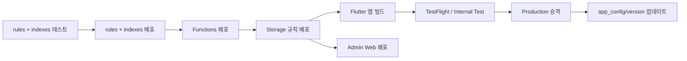

# 배포 가이드

> English: [DEPLOY_en.md](./DEPLOY_en.md)

Firebase 백엔드 + Flutter 모바일 앱 + Next.js Admin Web + 홈 위젯(Android/iOS)까지 네 갈래 배포를 다룹니다. 모든 명령은 레포 루트에서 실행 기준입니다.

## 사전 준비

### 필수 도구
- Firebase CLI: `npm install -g firebase-tools` → `firebase login`
- Flutter stable + Xcode (iOS) + Android Studio / JDK 17
- Node 20+
- (선택) Vercel CLI: Admin Web 호스팅용

### Firebase 프로젝트 설정

`firebase.json` 핵심 구성:

```json
{
  "storage":   { "rules": "storage.rules" },
  "firestore": { "rules": "firestore.rules", "indexes": "firestore.indexes.json" },
  "functions": [{ "source": "functions", "codebase": "default" }],
  "emulators": { "firestore": { "port": 8080 }, "auth": { "port": 9099 } }
}
```

`firebase use <project-id>` 로 대상 프로젝트 선택.

## 1. Firestore Rules & Indexes

```bash
# 로컬 에뮬레이터 확인
firebase emulators:start --only firestore,auth

# 규칙 테스트 (CI와 동일)
cd tests/firestore-rules
npm install
firebase emulators:exec --only firestore,auth --project hansol-test "npm test"
cd ..

# 배포
firebase deploy --only firestore:rules,firestore:indexes
```

**주의**: 규칙 변경은 실배포 즉시 반영됩니다. 반드시 [testing.md](./docs/testing.md)의 34개 rules 테스트 통과 확인 후 배포하세요. 관련 배경: [security.md](./docs/security.md).

## 2. Cloud Storage Rules

```bash
firebase deploy --only storage
```

Storage 규칙은 `storage.rules` 파일. 사용자 업로드(프로필 사진, 게시글 이미지) 경로를 관리합니다.

## 3. Cloud Functions

```bash
cd functions
npm install
cd ..

firebase deploy --only functions
# 특정 함수만
firebase deploy --only functions:kakaoCustomAuth
```

배포 전 체크:
- `functions/index.js` 에서 환경 변수 필요 여부 (예: `firebase functions:config:set kakao.secret="..."`). 단, v2 Functions는 `secrets`/`params` 방식도 가능.
- Blaze 요금제 필수 (외부 네트워크 호출 — Kakao API 등)

Functions 목록은 [architecture-overview.md](./docs/architecture-overview.md#cloud-functions-트리거-맵) 참조.

## 4. Flutter 모바일 앱

### 4.1 로컬 실행용 파일 생성

CI가 더미로 대체하는 세 파일에 실제 값 주입:

- `lib/api/nies_api_keys.dart` — NEIS API 키
- `lib/firebase_options.dart` — `flutterfire configure` 로 자동 생성
- `lib/api/kakao_keys.dart` — Kakao 네이티브 앱 키
- `android/app/google-services.json`
- `ios/Runner/GoogleService-Info.plist`

### 4.2 Android 릴리즈

```bash
# 디버그 APK
flutter build apk --debug --target-platform android-arm64

# 릴리즈 APK (서명 필요)
flutter build apk --release

# App Bundle (Play Store 업로드)
flutter build appbundle --release
```

**서명**: `android/key.properties` + 키스토어 파일 준비. Play Console에서 "Internal testing → Production" 순서로 승격.

**APK 크기**: 약 27 MB (universal).

### 4.3 iOS 릴리즈

```bash
# 번호 올리기
# pubspec.yaml: version: 1.0.0+2 → 1.0.1+3

flutter build ipa --release
```

Xcode Archive → App Store Connect 업로드. TestFlight 확인 후 App Store 심사.

**App Groups**: iOS 홈 위젯 데이터 공유에 필요. `Runner` + `Widget*` 타겟 모두 동일 App Group 추가.

### 4.4 버전 정책

`pubspec.yaml` 의 `version: X.Y.Z+B` 를 올리고, Firestore `app_config/version` 문서를 함께 업데이트:

```json
{
  "latest": "1.0.3+10",
  "minimum": "1.0.1+5",
  "requiredNote": "주요 보안 업데이트"
}
```

`minimum` 미만은 필수 업데이트 다이얼로그 표시 ([public-features.md#앱-업데이트--오프라인](./docs/features/public-features.md#앱-업데이트--오프라인)).

## 5. Admin Web (`/admin-web`)

```bash
cd admin-web
npm install
npm run dev   # 로컬
npm run build # 프로덕션 빌드
npm start     # 로컬 실행
```

### 호스팅 옵션
- **Vercel** (권장): GitHub 연동 → 자동 배포
- **Firebase Hosting**: `firebase.json`에 `hosting` 섹션 추가 필요 (현재 미설정)
- **셀프 호스팅**: `npm run build` → Node.js 서버

### 환경 변수
- Firebase Client SDK 설정 (`NEXT_PUBLIC_FIREBASE_*`)
- 인증된 admin 사용자만 접근하도록 페이지 가드 구현

## 6. 홈 위젯

### Android
- `android/app/src/main/` 하위에 AppWidgetProvider 클래스
- `home_widget` 패키지가 Flutter ↔ SharedPreferences ↔ Java 브릿지 제공
- 자정 갱신: `AlarmManager` + `HomeWidgetBackgroundIntent`

### iOS
- `ios/Widget*` 디렉터리 (WidgetKit)
- App Groups 설정 필수
- Timeline 1시간 주기 갱신

별도 배포 불필요 — 앱 빌드에 포함됩니다.

## 7. 환경 변수 / 시크릿 관리

| 용도 | 저장 위치 | 배포 시점 |
|---|---|---|
| NEIS API 키 | `lib/api/nies_api_keys.dart` (로컬) | 앱 빌드에 컴파일 |
| Firebase 설정 | `firebase_options.dart`, `google-services.json`, `GoogleService-Info.plist` | 앱 빌드 |
| Kakao 앱 키 | `lib/api/kakao_keys.dart` | 앱 빌드 |
| Kakao 관리자 키 (CF) | `firebase functions:config` 또는 Secret Manager | Functions 배포 |
| Android 서명 | `android/key.properties`, `.jks` | 로컬 빌드 머신 |
| iOS 서명 | Xcode Automatic Signing / 프로비저닝 프로파일 | 로컬 빌드 머신 |

**절대 커밋 금지**: 실제 키 파일은 `.gitignore` 처리 확인. CI는 더미 값으로 빌드만 검증합니다 ([cicd-setup.md](./docs/cicd-setup.md)).

## 8. 순차 배포 권장 순서



규칙/Functions를 앱보다 **먼저** 배포해야 구 버전 앱이 새 규칙 하에서 깨지지 않습니다.

## 9. 롤백

- **Rules**: `git revert` + `firebase deploy --only firestore:rules` 재배포
- **Functions**: 이전 커밋 checkout 후 `firebase deploy --only functions:<name>`
- **App**: 스토어 심사 거절 상태라면 빌드 버전 내림. 이미 릴리즈된 경우 긴급 패치 릴리즈 필요
- **Admin Web**: Vercel은 이전 배포 promote 가능

## 관련 문서
- [CI/CD 설정](./docs/cicd-setup.md)
- [보안 모델](./docs/security.md)
- [아키텍처 개요](./docs/architecture-overview.md)
- [기여 가이드](./CONTRIBUTING.md)
