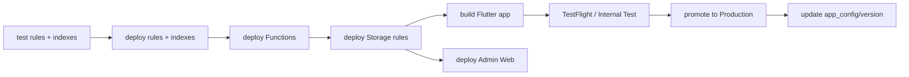

# Deployment Guide

> 한국어: [DEPLOY.md](./DEPLOY.md)

Covers four deployment tracks: Firebase backend, Flutter mobile app, Next.js Admin Web, and home widgets (Android/iOS). All commands assume the repo root as CWD.

## Prerequisites

### Required Tools
- Firebase CLI: `npm install -g firebase-tools` → `firebase login`
- Flutter stable + Xcode (iOS) + Android Studio / JDK 17
- Node 20+
- (Optional) Vercel CLI for Admin Web hosting

### Firebase Project Setup

`firebase.json` core:

```json
{
  "storage":   { "rules": "storage.rules" },
  "firestore": { "rules": "firestore.rules", "indexes": "firestore.indexes.json" },
  "functions": [{ "source": "functions", "codebase": "default" }],
  "emulators": { "firestore": { "port": 8080 }, "auth": { "port": 9099 } }
}
```

Select target project via `firebase use <project-id>`.

## 1. Firestore Rules & Indexes

```bash
# local emulator
firebase emulators:start --only firestore,auth

# rules tests (same as CI)
cd tests/firestore-rules
npm install
firebase emulators:exec --only firestore,auth --project hansol-test "npm test"
cd ..

# deploy
firebase deploy --only firestore:rules,firestore:indexes
```

**Warning**: Rules changes take effect immediately. Always run the 34 rules tests ([testing_en.md](https://monkshark.github.io/hansol_hs_flutter_app/#guides/testing_en.md)) before deploying. Background: [security_en.md](https://monkshark.github.io/hansol_hs_flutter_app/#guides/security_en.md).

## 2. Cloud Storage Rules

```bash
firebase deploy --only storage
```

Rules live in `storage.rules`. They govern user uploads (profile pictures, post images).

## 3. Cloud Functions

```bash
cd functions
npm install
cd ..

firebase deploy --only functions
# specific function
firebase deploy --only functions:kakaoCustomAuth
```

Pre-flight:
- Check if `functions/index.js` needs env vars (e.g. `firebase functions:config:set kakao.secret="..."`, or use v2 `secrets`/`params`)
- **Blaze plan required** (outbound network — Kakao API)

Function list → [architecture-overview_en.md](./docs/guides/architecture-overview_en.md#cloud-functions-trigger-map).

## 4. Flutter Mobile App

### 4.1 Local Secret Files

Three files the CI stubs out with dummies — inject real values:

- `lib/api/nies_api_keys.dart` — NEIS API key
- `lib/firebase_options.dart` — generated by `flutterfire configure`
- `lib/api/kakao_keys.dart` — Kakao native app key
- `android/app/google-services.json`
- `ios/Runner/GoogleService-Info.plist`

### 4.2 Android Release

```bash
# debug APK
flutter build apk --debug --target-platform android-arm64

# release APK (signed)
flutter build apk --release

# App Bundle (Play Store upload)
flutter build appbundle --release
```

**Signing**: set up `android/key.properties` + keystore. Promote through Play Console "Internal testing → Production".

**APK size**: ~27 MB (universal).

### 4.3 iOS Release

```bash
# bump version, e.g. pubspec.yaml: 1.0.0+2 → 1.0.1+3
flutter build ipa --release
```

Xcode Archive → upload to App Store Connect → TestFlight → App Review.

**App Groups**: required for iOS home widget data sharing. Add the same App Group to both `Runner` and `Widget*` targets.

### 4.4 Versioning

Bump `version: X.Y.Z+B` in `pubspec.yaml` and update Firestore `app_config/version`:

```json
{
  "latest": "1.0.3+10",
  "minimum": "1.0.1+5",
  "requiredNote": "Important security update"
}
```

Anything below `minimum` shows a blocking update dialog ([public-features_en.md#app-update--offline](./docs/features/public-features_en.md#app-update--offline)).

## 5. Admin Web (`/admin-web`)

```bash
cd admin-web
npm install
npm run dev   # local
npm run build # production build
npm start     # run locally
```

### Hosting Options
- **Vercel** (recommended): GitHub integration, auto-deploy
- **Firebase Hosting**: add `hosting` section to `firebase.json` (currently unset)
- **Self-hosted**: `npm run build` → Node.js server

### Environment Variables
- Firebase client SDK (`NEXT_PUBLIC_FIREBASE_*`)
- Page guards enforce admin-only access

## 6. Home Widgets

### Android
- `AppWidgetProvider` classes under `android/app/src/main/`
- `home_widget` package bridges Flutter ↔ SharedPreferences ↔ Java
- Midnight refresh: `AlarmManager` + `HomeWidgetBackgroundIntent`

### iOS
- `ios/Widget*` directory (WidgetKit)
- App Groups required
- 1-hour Timeline refresh

No separate deployment — widgets ship with the app.

## 7. Secrets Management

| Purpose | Location | Injection point |
|---|---|---|
| NEIS API key | `lib/api/nies_api_keys.dart` (local) | compiled into app build |
| Firebase config | `firebase_options.dart`, `google-services.json`, `GoogleService-Info.plist` | app build |
| Kakao app key | `lib/api/kakao_keys.dart` | app build |
| Kakao admin key (CF) | `firebase functions:config` or Secret Manager | Functions deploy |
| Android signing | `android/key.properties`, `.jks` | local build machine |
| iOS signing | Xcode Automatic Signing / provisioning profile | local build machine |

**Never commit real keys.** Verify `.gitignore`. CI only validates builds with dummy values ([cicd-setup_en.md](https://monkshark.github.io/hansol_hs_flutter_app/#guides/cicd-setup_en.md)).

## 8. Recommended Deploy Order



Deploy rules and Functions **before** the app so old clients don't break under new rules.

## 9. Rollback

- **Rules**: `git revert` + `firebase deploy --only firestore:rules`
- **Functions**: checkout previous commit → `firebase deploy --only functions:<name>`
- **App**: pull build from review if still pending. Released builds need an emergency patch release.
- **Admin Web**: Vercel lets you promote a previous deploy.

## Related Docs
- [CI/CD Setup](https://monkshark.github.io/hansol_hs_flutter_app/#guides/cicd-setup_en.md)
- [Security Model](https://monkshark.github.io/hansol_hs_flutter_app/#guides/security_en.md)
- [Architecture Overview](https://monkshark.github.io/hansol_hs_flutter_app/#guides/architecture-overview_en.md)
- [Contributing Guide](./CONTRIBUTING_en.md)
