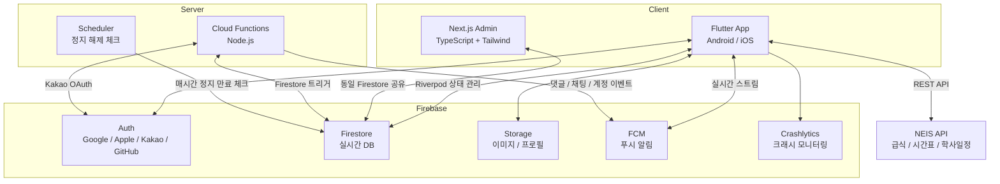
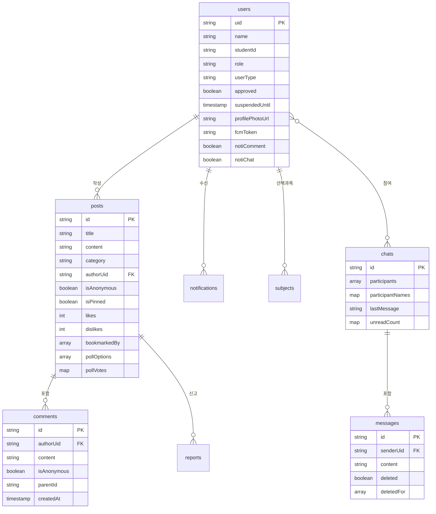

# 한솔고등학교 앱

> 세종시 한솔고등학교 학생·교사·졸업생·학부모를 위한 통합 학교 플랫폼

Flutter 기반 모바일 앱 + Next.js 관리자 대시보드로 구성된 풀스택 프로젝트입니다. NEIS 공공데이터 API 연동, Firebase 실시간 데이터베이스, 역할 기반 권한 시스템, 푸시 알림, 1:1 채팅 등 실서비스 수준의 기능을 구현했습니다.

## 스크린샷

| 온보딩 | 로그인 | 홈 | 홈 (라이트) |
|:--:|:--:|:--:|:--:|
|  |  |  |  |

| 급식 | 일정 | 일정 만들기 | 게시판 |
|:--:|:--:|:--:|:--:|
|  |  |  |  |

| 게시글 상세 | 글쓰기 | 채팅 목록 | 채팅방 |
|:--:|:--:|:--:|:--:|
|  |  |  |  |

| 시간표 | 설정 | 내 계정 | 알림 설정 |
|:--:|:--:|:--:|:--:|
|  |  |  |  |

| Admin | Admin Web | Admin Web (다크) |
|:--:|:--:|:--:|
|  |  |  |

| 위젯 (라이트) | 위젯 (다크) |
|:--:|:--:|
|  |  |

## Metrics

| 지표 | 수치 | 비고 |
|------|------|------|
| **총 코드 라인** | **21,400+** | Dart 17,070 + TypeScript 1,882 + Java/XML 1,124 + Swift 330 + JS 737 |
| **소스 파일** | **67개** (Flutter) + **11페이지** (Admin Web) + **5개** (Android Widget) + **1개** (iOS Widget) | 25 screens, 38 models/utils/widgets |
| **Cloud Functions** | **8개** | 푸시 알림, OAuth, 스케줄러, 계정 삭제 |
| **OAuth 로그인** | **4종** | Google, Apple, Kakao, GitHub |
| **푸시 알림** | **13종** | FCM 10 + 로컬 3, 카테고리별 개별 on/off |
| **테스트** | **18개** | 핵심 비즈니스 로직(모델/유틸) 집중 테스트 |
| **이미지 압축** | **용량 70% 감소** | 게시글 640px, 프로필 256px |
| **API 최적화** | **호출 30회 → 1회** | 월간 프리페치 + Completer 패턴 |
| **Firestore 절감** | **읽기 30~50% 감소** | 오프라인 캐시 + limit 최적화 |
| **운영 비용** | **$0~3/월** | 1,000명 기준, 무료 한도 내 운영 가능 |

## 아키텍처

## 기술 스택

| 분류 | 기술 |
|------|------|
| **Mobile** | Flutter (Dart) — Android / iOS |
| **State** | Riverpod — 상태 관리 |
| **Admin Web** | Next.js 14 — App Router, TypeScript, Tailwind CSS |
| **Backend** | Firebase — Auth, Firestore, Storage, FCM, Crashlytics |
| **Server** | Cloud Functions (Node.js) — 푸시 알림, Kakao OAuth, 스케줄러 |
| **External API** | NEIS 공공데이터 — 급식, 시간표, 학사일정 |
| **Local** | sqflite (일정 DB), SharedPreferences (설정/캐시) |
| **Auth** | Google, Apple, Kakao, GitHub OAuth |
| **CI** | GitHub Actions — Flutter analyze + test |
| **Test** | flutter_test — Unit Test (18 tests) |

## 주요 기능

<b>급식 조회</b>

- **NEIS API** 기반 조식/중식/석식 메뉴 실시간 조회
- **월간 프리페치** 캐시 (24시간/빈 결과 5분), Completer 패턴으로 동시 요청 방지
- 급식 카드 탭 → 이미지 공유, **영양 성분** (탄수화물/단백질/지방 등) + 알레르기 유발 식품 표시
- 급식 알림에 메뉴 미리보기 포함

<b>시간표</b>

- **1학년**: 반별 자동 조회 / **2-3학년**: 선택과목 기반 맞춤 시간표
- **교사 전용 시간표**: 학년 탭(1/2/3학년) → 과목 스와이프 → 중복 반 선택
- **충돌 자동 감지** + 해결 팝업, 과목별 컬러 커스터마이징 (원형 피커)
- **현재 교시** 실시간 표시 (1분 갱신, 프로그레스 바), 오늘 요일 하이라이트
- 선택과목 저장 확인 + 미저장 뒤로가기 경고
- 새 학기(3월) 시간표 + 선택과목 자동 리셋

<b>일정 관리</b>

- **커스텀 월간 캘린더** (스와이프 월 이동, 유동적 주 수, 한국어)
- **연속 학사일정 바** (끊김 없이 이어지는 컬러 바 + 일정명 표시)
- **개인일정** 하루/연속, **6색 + 원형 컬러피커** (밝기 조절)
- **NEIS 학사일정** 자동 표시, 개인일정 색상 점
- **D-day** 관리 + 홈 화면 핀 고정

<b>게시판</b>

- **6개 카테고리**: 자유 / 질문 / 정보공유 / 분실물 / 학생회 / 동아리
- **커서 기반 페이지네이션** (20개씩, 무한 스크롤, 당겨서 새로고침)
- **공지 시스템** (최대 3개, 상단 고정, 관리자 전용)
- **댓글 + 대댓글** (들여쓰기), 글쓴이 댓글 구분 (파란 배경 + 뱃지)
- **익명 번호제**: 익명1/익명2/익명(글쓴이), Firestore Transaction
- **투표** 첨부 (최대 6선택지, 실시간 결과 바), 추천/비추천
- **일정 공유**, 사진 첨부 (640px 압축), 북마크/저장
- **이미지 뷰어** (핀치 줌), 키워드 검색, 스켈레톤 로딩
- **바텀시트 메뉴** (아이콘 + 텍스트, 삭제/신고 빨간색 강조)
- 신고, 사용자 차단, 글 자동 삭제 (TTL), Rate Limiting
- **내 활동**: 내가 쓴 글 / 내가 쓴 댓글 / 저장한 글

<b>1:1 채팅</b>

- **유저 검색**으로 새 채팅 시작 (이름/학번 검색, 관리자 기본 표시)
- **실시간 메시지** (Firestore onSnapshot, limit 30)
- **읽음 표시** + 읽지 않은 메시지 수 뱃지
- **메시지 삭제**: 나만 삭제 / 같이 삭제 (안 읽었고 1시간 이내)
- **채팅방 나가기**: 시스템 메시지 + 상대방 채팅 유지
- 스켈레톤 로딩 UI

<b>알림 시스템</b>

- **알림 설정 화면**: 5개 카테고리별 개별 on/off
- **급식 알림**: 로컬 스케줄링 (조식/중식/석식, 시간 설정, 메뉴 미리보기)
- **인앱 알림**: 댓글/답글/계정 (벨 아이콘 + 뱃지)
- **FCM 푸시**: 댓글, 대댓글, 새 글, 가입/승인/거절/정지/정지 해제/역할변경, 채팅
- **정지 만료 자동 해제**: Cloud Functions 스케줄러 (매시간)

<b>건의사항</b>

- **앱 건의사항 & 버그 제보** + **학생회 건의사항**
- 텍스트(1000자) + 사진 첨부(최대 3장)
- 상태 관리: 대기중 → 확인됨 → 해결됨 → 삭제 (로그 기록)

<b>긴급 팝업 공지</b>

- 앱 실행 시 **모달 팝업**으로 중요 공지 표시
- **3종 타입**: 긴급(빨강), 공지(파랑), 이벤트(초록)
- **시작/종료일** 설정 → 기간 외 자동 비활성화
- **"오늘 안 보기"** 지원 (관리자 설정으로 비활성화 가능)
- 앱 Admin 화면 + Admin Web에서 작성/관리

<b>인증 & 권한</b>

- **4종 OAuth**: Google / Apple / Kakao / GitHub (SVG 브랜드 로고)
- **신분 선택**: 재학생 / 졸업생 / 교사 / 학부모
- **승인 플로우**: 가입 요청 → 관리자 승인
- **3단계 역할**: user → manager → admin
- **계정 정지** (1시간~30일, 자동 해제) + **회원 탈퇴** (이중 확인, 완전 삭제)
- **프로필 사진**, 개인정보 동의, 온보딩 → 로그인 플로우

<b>관리자 대시보드 (Next.js)</b>

- **통계 카드** + 게시글/사용자/신고 관리
- **ExpansionTile** 기반 Admin 화면 (승인 대기/정지/사용자/신고/삭제 로그/건의사항)
- **크래시 로그** + **건의사항 관리** (상태 변경)
- **익명 실명 확인**, 감사 로그, **다크모드**, 모바일 반응형

<b>홈 화면 위젯 (Android)</b>

- **급식 위젯 (4×2)**: 오늘의 조식/중식/석식
- **시간표 위젯 (3×2)**: 오늘의 시간표, 현재 교시 강조
- **급식+시간표 통합 위젯 (5×2)**: 급식과 시간표를 한 화면에
- 시스템 다크/라이트 모드 자동 대응
- **자정 자동 갱신** (AlarmManager + Dart 백그라운드 콜백)
- 앱 실행 시 자동 갱신, **Firestore 읽기 0** (캐시 데이터 활용)
- **iOS 위젯 (SwiftUI + WidgetKit)**: 급식 (Medium), 시간표 (Medium), 통합 (Large) 3종, App Groups를 통한 데이터 공유, 다크모드 자동 대응

<b>새 학년 프로필 업데이트</b>

- 재학생/교사만 **3월에 정보 업데이트 팝업** 표시
- 학년/반/번호 등 새 학년 정보 입력 유도
- **역할 변경 불가** (관리자만 역할 변경 가능)

<b>앱 업데이트 & 오프라인</b>

- **업데이트 체커**: Firestore `app_config/version`에서 최신/최소 버전 비교
  - **필수 업데이트**: 닫기 불가 다이얼로그 + 스토어 이동
  - **선택 업데이트**: "나중에" 버튼 포함 안내 다이얼로그
  - 버전 비교 로직 (`major.minor.patch`)
- **오프라인 배너**: 네트워크 끊기면 상단에 빨간 "오프라인 상태입니다" 표시, 재연결 시 자동 소멸
- **오프라인 캐시**: 급식/시간표는 로컬 캐시로 오프라인에서도 조회 가능

## 보안 & 개인정보 보호

- **Firestore 규칙**: 역할 기반 접근 제어, 필드 단위 update 검증
- **채팅 메시지 보안**: 참여자만 읽기/쓰기 가능, 메시지 업데이트 권한 제어 (삭제 기능용)
- **게시글 필드 단위 보호**: 비작성자는 좋아요/투표/북마크 필드만 수정 가능
- **Rate Limiting**: 글 30초, 댓글 10초 쿨타임
- **Cloud Functions**: 승인 상태 + 알림 설정 체크 후 발송
- **감사 로그**: 모든 관리 행위 + 게시글 삭제 이력 기록
- **크래시 모니터링**: Crashlytics + Firestore 기록
- **데이터 보호**: 이미지 압축, TTL 만료, 사용자 차단, 개인정보 동의
- **OAuth 전용 인증**: 비밀번호를 저장하지 않는 소셜 로그인 체계
- **회원 탈퇴 시 즉시 파기**: Firestore 문서 → Auth 계정 순서로 삭제하여 권한 오류 방지, 이름/프로필 사진/하위 컬렉션 완전 삭제
- **개인정보 처리방침**: 앱 내 표시, 가입 시 동의 필수

## 테스트 & CI/CD

| 구분 | 내용 |
|------|------|
| **Unit Test** | 급식 데이터 파싱, 일정 모델 직렬화, 사용자 프로필 검증 (18개) |
| **CI** | GitHub Actions — Push 시 자동 `flutter analyze` + `flutter test` 수행 |
| **정적 분석** | `--no-fatal-infos --no-fatal-warnings` 레벨로 코드 품질 관리 |
| **더미 데이터** | Node.js 스크립트로 Firestore 더미 데이터 삽입/삭제 자동화 |

## 데이터 모델

## Technical Challenges & Solutions

<b>Firebase Auth 토큰 동기화 문제 (Permission Denied)</b>

 

**문제:** 소셜 로그인 직후 Firestore 문서 조회 시 PERMISSION_DENIED 발생 — Auth 토큰이 Firestore SDK에 전파되기 전에 요청이 나감

**해결:** `getIdToken(true)`로 토큰 강제 갱신 + 최대 3회 재시도 로직으로 첫 설치/재로그인 시에도 안정적으로 프로필 확인

<b>급식 API 동시 요청 경합 (Race Condition)</b>

 

**문제:** 여러 화면에서 동시에 같은 월의 급식 데이터를 요청하면 중복 API 호출 발생

**해결:** `Completer` 패턴으로 동일 월 프리페치를 단일 Future로 병합, 진행 중인 요청이 있으면 기존 Future를 공유

<b>익명 게시판 번호 일관성 (Concurrent Write)</b>

 

**문제:** 클라이언트에서 익명 번호를 부여하면 동시 댓글 시 같은 번호가 중복 할당될 수 있음

**해결:** Firestore Transaction으로 게시글 문서의 `anonymousMap`을 원자적으로 읽기/쓰기하여 번호 중복 방지

<b>선택과목 시간표 충돌 (Slot Conflict)</b>

 

**문제:** 2-3학년 선택과목 조합 시 같은 교시에 다른 반의 수업이 겹칠 수 있음

**해결:** 시간표 빌드 시 슬롯별 충돌 자동 감지 → 사용자에게 선택 다이얼로그 표시, 선택 결과를 로컬에 저장하여 재충돌 방지

<b>Firestore 보안 규칙과 기능 충돌 (Field-level Validation)</b>

 

**문제:** 게시글 update를 `작성자만` 허용하면 다른 유저의 투표/추천이 차단됨

**해결:** `request.resource.data.diff(resource.data).affectedKeys().hasOnly([...])` 로 필드 단위 검증 — 인터랙션 필드만 변경 시 모든 인증 유저 허용

<b>채팅 읽음 확인 실시간 동기화 (Dual Stream)</b>

 

**문제:** 메시지 스트림과 별도로 읽음 상태를 추적하면 추가 Firestore 읽기 발생

**해결:** 채팅방 문서의 `unreadCount` 맵을 별도 `StreamBuilder`로 감시하여 단일 문서 스트림으로 읽음 상태 실시간 반영

<b>Cloud Functions 알림 설정 개별 제어 (Server-side Filtering)</b>

 

**문제:** FCM 푸시는 서버에서 발송하므로 클라이언트에서 카테고리별 on/off 불가

**해결:** Firestore `users/{uid}`에 `notiComment`, `notiReply`, `notiChat` 등 필드 저장, Cloud Functions에서 발송 전 해당 필드 체크하여 `false`면 발송 스킵

<b>정지 만료 자동 해제 (Scheduler Trigger)</b>

 

**문제:** 계정 정지 만료 시간이 지나도 Firestore 필드가 자동으로 삭제되지 않아 `onUserUpdated` 트리거 불발

**해결:** Cloud Functions Scheduler로 매시간 `suspendedUntil <= now`인 유저를 조회하여 필드 삭제 → `onUserUpdated` 트리거 → 정지 해제 푸시 발송

