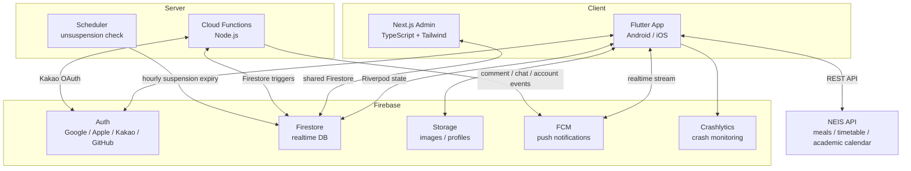
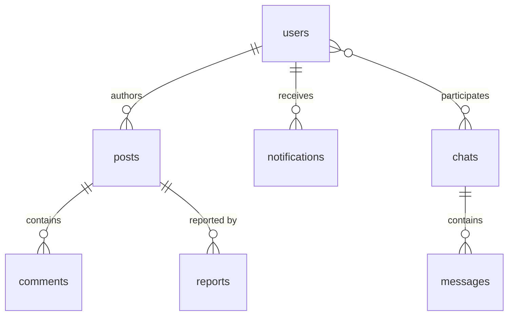

# Hansol High School App

> 한국어: [README.md](./README.md)

> An integrated school platform for students, teachers, alumni, and parents of Hansol High School (Sejong, Korea).

A full-stack project with a Flutter mobile app + Next.js admin dashboard. Features NEIS public-data API integration, Firebase real-time database, role-based access control, push notifications, 1:1 chat — at a production-service level.

## Documentation Hub

Documentation is split by topic. Jump in based on your purpose.

### First-time Contributors
1. [Product Overview](./docs/index.html#guides/product-overview_en.md)
2. [Architecture Overview](./docs/index.html#guides/architecture-overview_en.md)
3. [Architecture Decisions (ADRs)](./docs/index.html#guides/architecture-decisions_en.md)
4. Feature deep-dives: [Public](./docs/index.html#features/public-features_en.md) / [Community](./docs/index.html#features/community-features_en.md) / [Personal](./docs/index.html#features/personal-features_en.md) / [Admin](./docs/index.html#features/admin-features_en.md)
5. [Contributing Guide](./CONTRIBUTING_en.md)

### End Users (Students / Teachers / Alumni / Parents)
- [User Guide](./USER_GUIDE_en.md)
- [Public Features](./docs/index.html#features/public-features_en.md)
- [Account & Access](./docs/index.html#guides/account-and-access_en.md)

### Operations / Deployment
- [Deployment Guide](./DEPLOY_en.md)
- [CI/CD Setup](./docs/index.html#guides/cicd-setup_en.md)
- [Security Model](./docs/index.html#guides/security_en.md)
- [Architecture Overview](./docs/index.html#guides/architecture-overview_en.md)

### Further Reading
- [Data Model](./docs/index.html#guides/data-model_en.md)
- [Testing Strategy](./docs/index.html#guides/testing_en.md) — 524 Flutter + 34 Rules tests
- [Technical Challenges (14 cases)](./docs/index.html#guides/technical-challenges_en.md)
- [Screenshots Gallery](./docs/index.html#guides/screenshots-gallery_en.md)

### Per-File Technical Reference
> Detailed per-file docs for service / model / API / notification layers (for editing a specific file or tracing a flow)

- [📚 Full API Reference Index](./docs/index.html#README.md) — consolidated index for the items below
- [`main.md`](./docs/index.html#main.md) — app entry point, MainScreen, global state
- **API layer** (`docs/api/`): [meal_data_api](./docs/index.html#api/meal_data_api.md) · [timetable_data_api](./docs/index.html#api/timetable_data_api.md) · [notice_data_api](./docs/index.html#api/notice_data_api.md)
- **Data layer** (`docs/data/`): [auth_service](./docs/index.html#data/auth_service.md) · [grade_manager](./docs/index.html#data/grade_manager.md) · [local_database](./docs/index.html#data/local_database.md) · [post_repository](./docs/index.html#data/post_repository.md) · [search_tokens](./docs/index.html#data/search_tokens.md) · [service_locator](./docs/index.html#data/service_locator.md) · [setting_data](./docs/index.html#data/setting_data.md) · etc.
- **Notifications** (`docs/notification/`): [fcm_service](./docs/index.html#notification/fcm_service.md) · [daily_meal_notification](./docs/index.html#notification/daily_meal_notification.md) · [popup_notice](./docs/index.html#notification/popup_notice.md) · [update_checker](./docs/index.html#notification/update_checker.md)
- **State Management** (`docs/providers/`): [providers](./docs/index.html#providers/providers.md) — all Riverpod Notifier/AsyncNotifier
- **Network** (`docs/network/`): [network_status](./docs/index.html#network/network_status.md) · [offline_queue_manager](./docs/index.html#network/offline_queue_manager.md)
- **Styles** (`docs/styles/`): [app_colors](./docs/index.html#styles/app_colors.md) · [dark_app_colors](./docs/index.html#styles/dark_app_colors.md) · [light_app_colors](./docs/index.html#styles/light_app_colors.md)

## Screenshots (Summary)

| Home | Board | Chat | Timetable |
|:--:|:--:|:--:|:--:|
|  |  |  |  |

| Meal | Search Results | Grades (Susi) | Admin Web |
|:--:|:--:|:--:|:--:|
|  |  |  |  |

Full gallery → [Screenshots Gallery](./docs/index.html#guides/screenshots-gallery_en.md)

## Metrics

| Metric | Value | Notes |
|---|---|---|
| **Total LOC** | **~40,000** | Dart 33,389 + TypeScript/TSX + Java/XML + Swift + JS |
| **Source files** | **122** (Flutter) + **22** (Admin Web TS/TSX) + Android/iOS widgets | screens, extracted widgets, models/utils/services |
| **Cloud Functions** | **13** | Kakao OAuth · post/comment/like triggers · user C/U/D · chat · report · suspension scheduler · OG renderer · old-post cleanup |
| **OAuth providers** | **4** | Google, Apple, Kakao, GitHub |
| **Push notifications** | **4 FCM types** | `account` / `comment` / `new_post` / `chat` (+ local breakfast/lunch/dinner). Per-category on/off |
| **Tests** | **524 / 34** | Flutter 520 (test 440 + testWidgets 80) + Integration 4 + Firestore Rules emulator 34 |
| **Docs** | **75 MDs (≈9,544 lines)** | Root 8 + `docs/guides/` 20 + `docs/features/` 8 + per-file details `docs/{api,data,...}` 39 |
| **State management** | **Riverpod 2.5** | AsyncNotifier/Notifier + GetIt + repository DI |
| **Image compression** | **~70% reduction** | Posts: 1080px w/ EXIF/GPS stripped, profiles: 256px |
| **Search** | **Firestore n-gram index** | Title+body 2-gram `array-contains-any`, 350ms debounce |
| **Sensitive data** | **flutter_secure_storage** | Grades live in Android Keystore / iOS Keychain only |
| **API optimization** | **30 calls → 1** | Monthly prefetch + Completer pattern |
| **Firestore reads** | **30–50% reduction** | Offline cache + `limit()` optimization |
| **Operating cost** | **$0–3/month** | ~1,000 users, within free tier |

### Performance / Size (measured)

| Item | Value | Method |
|---|---|---|
| **Release APK** | **27 MB** | `build/app/outputs/flutter-apk/app-release.apk` (universal) |
| **Dart LOC** | **33,389** | `find lib -name '*.dart' \| xargs cat \| wc -l` |
| **Dart files** | **122** | `find lib -name '*.dart' \| wc -l` |
| **Flutter test count** | **524** | test() 440 + testWidgets() 80 + Integration 4 |
| **Rules test count** | **34** | `firebase emulators:exec ... npm test` |
| **Compressed image size** | **~30% of original** | 1080px wide, JPEG q80, EXIF stripped |
| **Search fetch limit** | **50 / 350ms debounce** | `array-contains-any` + client-side substring filter |
| **Board page size** | **20 / cursor pagination** | `startAfterDocument` + `limit(20)` |

## Architecture (Summary)

- **Riverpod provider dependency graph** and **layered data-flow model** → [architecture-overview_en.md](./docs/index.html#guides/architecture-overview_en.md)
- Storage allocation rationale (sqflite / Firestore / SecureStorage / Cloud Storage) → [ADR-06](./docs/index.html#guides/architecture-decisions_en.md)

### 🔗 [Interactive Riverpod Graph (GitHub Pages)](https://monkshark.github.io/hansol_hs_flutter_app/riverpod_graph.html)

D3.js-based zoom/drag graph. Source HTML at `docs/riverpod_graph.html`.

## Architecture Decisions (Summary)

| ADR | Decision | Link |
|---|---|---|
| 01 | State mgmt = Riverpod 2.5 | [link](./docs/guides/architecture-decisions_en.md#adr-01-state-management-riverpod-25) |
| 02 | Grade storage = flutter_secure_storage (local-only) | [link](./docs/guides/architecture-decisions_en.md#adr-02-sensitive-data-storage-flutter_secure_storage) |
| 03 | Board search = client-side n-gram index | [link](./docs/guides/architecture-decisions_en.md#adr-03-board-search-client-side-n-gram-indexing) |
| 04 | Like counter = `Map<uid,bool>` + denormalized int | [link](./docs/guides/architecture-decisions_en.md#adr-04-like-counter-mapuidbool--denormalized-int) |
| 05 | Charts = direct `CustomPainter` | [link](./docs/guides/architecture-decisions_en.md#adr-05-charts-custompainter-directly) |
| 06 | Storage allocation = SQLite/Firestore/SecureStorage/Cloud Storage | [link](./docs/guides/architecture-decisions_en.md#adr-06-storage-allocation) |
| 07 | DI = GetIt + abstract repository | [link](./docs/guides/architecture-decisions_en.md#adr-07-di-getit--abstract-repository) |
| 08 | Test strategy = 4 layers (Unit/Provider/Widget/Rules) | [link](./docs/guides/architecture-decisions_en.md#adr-08-test-strategy-unit--provider--widget--rules) |

Full details → [architecture-decisions_en.md](./docs/index.html#guides/architecture-decisions_en.md).

## Tech Stack

| Category | Tech |
|---|---|
| **Mobile** | Flutter (Dart) — Android / iOS |
| **State** | Riverpod 2.5 — AsyncNotifier / Notifier |
| **DI** | GetIt + abstract repository — mockable |
| **Admin Web** | Next.js 14 — App Router, TypeScript, Tailwind |
| **Backend** | Firebase — Auth, Firestore, Storage, FCM, Crashlytics |
| **Server** | Cloud Functions (Node.js) — push, Kakao OAuth, scheduler |
| **External API** | NEIS public data — meals, timetable, academic calendar |
| **Local** | sqflite (schedule DB), SharedPreferences (settings/cache) |
| **Auth** | Google / Apple / Kakao / GitHub OAuth |
| **CI** | GitHub Actions — analyze + test + Codecov + Android APK |
| **Test** | `flutter_test` — Unit + Widget + Provider + Golden + Integration (524) + Firestore rules (34) |

## Features (Summary)

| Category | Highlights | Deep dive |
|---|---|---|
| **Public** | Meals, timetable, academic calendar, urgent popup, home widgets (Android/iOS), offline | [public-features_en.md](./docs/index.html#features/public-features_en.md) |
| **Community** | Board (6 categories + popular + n-gram search), 1:1 chat, notifications, feedback | [community-features_en.md](./docs/index.html#features/community-features_en.md) |
| **Personal** | Grades (susi/jeongsi, local-only), schedules, D-day, profile | [personal-features_en.md](./docs/index.html#features/personal-features_en.md) |
| **Admin** | Flutter admin + Next.js Admin Web, approval/suspension/report/feedback/audit logs | [admin-features_en.md](./docs/index.html#features/admin-features_en.md) |

## Security & Privacy

- **Firestore rules**: role-based access control + per-field update validation + `validCounterDelta(±1)`
- **Grades stay local**: `flutter_secure_storage` → Android Keystore / iOS Keychain. Never uploaded.
- **Rate limiting**: 30s post cooldown, 10s comment cooldown, duplicate-report index.
- **On deletion**: Firestore → Storage → Auth order for complete erasure.
- **OAuth only**: no passwords stored.

Details → [security_en.md](./docs/index.html#guides/security_en.md).

## Testing & CI/CD

- **524 Flutter tests + 34 Rules tests** (Unit / Widget / Provider / Golden / Repository / Integration / Firestore Rules)
- `flutter test` locally / `firebase emulators:exec ... npm test` for rules
- Two GitHub Actions workflows: [flutter.yml](./.github/workflows/flutter.yml), [firestore-rules.yml](./.github/workflows/firestore-rules.yml)
- Codecov upload, debug APK artifact on master push

Details → [testing_en.md](./docs/index.html#guides/testing_en.md), [cicd-setup_en.md](./docs/index.html#guides/cicd-setup_en.md).

## Data Model (Summary)

Collection schema, indexes, and rule mappings → [data-model_en.md](./docs/index.html#guides/data-model_en.md).

## Technical Challenges (Highlights)

3 picks from 14 real production cases:

<b>Admin screen Firestore reads: 130 → 20–30</b>

Swapped `StreamBuilder` for `FutureBuilder` + collapsed `ExpansionTile` child lazy render. Closed tabs do 0 reads.

→ [technical-challenges_en.md#9](./docs/guides/technical-challenges_en.md#9-admin-screen-firestore-read-overload-stream--future-transition)

<b>StatefulWidget 1,400+ lines → Stateless composition (-43%)</b>

Four large screens 4,575 → 2,589 lines, 15 widget modules extracted, 113 tests still green.

→ [technical-challenges_en.md#13](./docs/guides/technical-challenges_en.md#13-statefulwidget-1400-lines--stateless-composition-refactoring)

<b>Riverpod AsyncNotifier <code>invalidateSelf</code> race</b>

Async `ref.invalidateSelf()` made provider tests flaky. Fixed by replacing state directly in mutators.

→ [technical-challenges_en.md#11](./docs/guides/technical-challenges_en.md#11-riverpod-asyncnotifier-race-condition-invalidateself)

**All 14 cases** → [technical-challenges_en.md](./docs/index.html#guides/technical-challenges_en.md)

## License

Published for learning and portfolio purposes. School logos and image assets may not be reused.

## Contact

- Bugs / feature requests: GitHub Issues · justinchoo0814@gmail.com · IG [@void___main](https://instagram.com/void___main)
- In-app: Settings → Feedback / bug report
