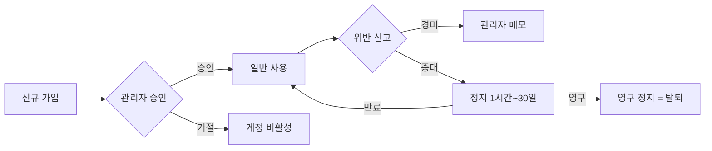

# 관리자 기능 (Flutter Admin + Next.js Admin Web)

> English: [admin-features_en.md](./admin-features_en.md)

`manager` / `admin` 역할 사용자를 위한 관리 기능입니다. Flutter 앱 내 Admin 화면과 별도 Next.js 대시보드 두 채널로 제공됩니다.

## 역할 체계

| 역할 | 권한 범위 |
|---|---|
| `user` | 일반 기능 |
| `manager` | 승인/정지 없는 사용자 관리 + 모든 일반 기능 |
| `admin` | 모든 권한 (다른 admin 임명 포함) |

**검증 위치**: `firestore.rules`의 `isAdminOrManager()` / `isAdmin()` 헬퍼. Cloud Functions는 호출 시 Firestore `role` 필드 재확인.

## Flutter Admin 화면

**진입**: 설정 → 관리자 (manager/admin만 표시)

### ExpansionTile 기반 탭 구조

5개 섹션이 펼쳤다 접었다 할 수 있는 `ExpansionTile` 카드로 구성 — 닫힌 탭은 child 렌더 안 함으로 Firestore 읽기 0 ([기술과제 #9](../guides/technical-challenges.md#9-관리자-화면-firestore-읽기-과다-stream--future-전환))

| 탭 | 내용 |
|---|---|
| **승인 대기** | `approved: false` 사용자 목록 → 승인/거절 |
| **정지** | 정지 기간 설정 (1시간~30일) / 즉시 해제 |
| **사용자** | 전체 검색, 역할 변경, 상세 보기 |
| **신고** | 신고된 글/댓글 목록, 삭제 처리 |
| **삭제 로그** | `admin_logs` 최근 액션 |
| **건의사항** | 상태 변경 (대기 → 확인 → 해결) |

### 액션 후 수동 갱신

- `StreamBuilder` 대신 `FutureBuilder` → 액션 후 `_refresh()` 호출
- **결과**: 화면 열 때 130+ 읽기 → 20~30으로 감소

**관련 파일**: `lib/screens/board/admin_screen.dart`, `lib/screens/board/admin/users_tab.dart`

## Next.js Admin Web (`/admin-web`)

웹 브라우저에서 접속 가능한 별도 대시보드. 동일 Firestore를 공유하며 `admin` 역할만 접근 가능.

### 페이지 구성

`admin-web/app/` 하위:

| 경로 | 내용 |
|---|---|
| `dashboard/` | 통계 카드 (사용자 수, 신고 수, 대기 건 등) |
| `users/` | 사용자 검색/필터/승인/정지/역할 변경 |
| `posts/` | 게시글 검색/삭제 |
| `comments/` | 댓글 모더레이션 |
| `reports/` | 신고 큐 처리 |
| `feedbacks/` | 건의사항 상태 변경 |
| `crashes/` | Crashlytics 로그 Firestore 미러 조회 |
| `function-logs/` | Cloud Functions 오류 로그 (`function_logs` 컬렉션) |
| `settings/` | 긴급 팝업 공지, 앱 버전 (`app_config`) |

### 공통 UX

- **다크 모드** 토글, 모바일 반응형
- **익명 → 실명 확인** (admin만, 감사 로그 남김)
- **감사 로그 기록**: 모든 관리 행위 (`admin_logs`)

**관련 파일**: `admin-web/app/`, `admin-web/components/`, `admin-web/lib/`

## 감사 로그 (`admin_logs`)

| 필드 | 예시 |
|---|---|
| `action` | `approve_user`, `suspend_user`, `change_role`, `delete_post`, `resolve_feedback` |
| `actorUid` | 액션 수행한 관리자 |
| `targetUid` / `targetPostId` | 대상 |
| `detail` | JSON 필드 (이전/이후 값) |
| `createdAt` | 타임스탬프 |

인덱스: `action ASC, createdAt DESC` → Admin Web에서 액션별 필터 가능.

## 크래시 모니터링

- **Crashlytics** 기본 대시보드는 Firebase 콘솔에서 확인
- 추가로 `function_logs` 컬렉션에 Cloud Functions 오류 저장
- Admin Web `crashes/`에서 Firestore 미러 조회 (빠른 쿼리 / 필터 / 삭제)

## 긴급 팝업 공지 관리

- `app_config/announcement` 문서 수정
- 필드: `title`, `body`, `type` (`urgent`/`notice`/`event`), `startAt`, `endAt`, `hideToday`
- 사용자 동작은 [공개 기능 > 긴급 팝업 공지](./public-features.md#긴급-팝업-공지) 참조

## 사용자 관리 플로우

- **자동 정지 해제**: Cloud Functions 스케줄러가 매시간 `suspendedUntil <= now` 조회 → 필드 삭제 → `onUserUpdated` 트리거 → 해제 푸시

## 관련 문서
- [인증 & 접근](../guides/account-and-access.md)
- [보안 모델](../guides/security.md) — rules 헬퍼 함수, 필드 단위 검증
- [CI/CD & 배포](../guides/cicd-setup.md)
- [배포 가이드](../DEPLOY.md)
