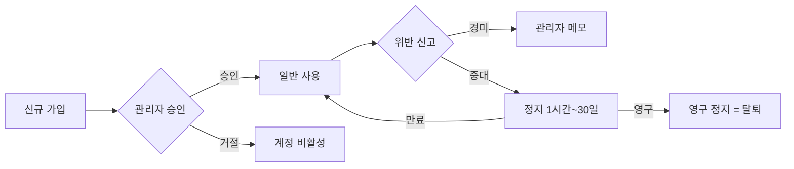

# 관리자 기능 (Flutter Admin + Next.js Admin Web)

> English: [admin-features_en.md](./admin-features_en.md)

`manager` / `admin` / `moderator` / `auditor` 역할 사용자를 위한 관리 기능입니다. Flutter 앱 내 Admin 화면과 별도 Next.js 대시보드 두 채널로 제공됩니다.

## 역할 체계

| 역할 | 권한 범위 |
|---|---|
| `user` | 일반 기능 |
| `moderator` | 게시글/댓글 삭제, 신고 읽기/처리, `admin_logs` 기록. 사용자 관리·대시보드/통계·설정·건의사항 접근 불가 |
| `auditor` | 읽기 전용. `admin_logs`, 통계, 신고, 건의사항, `crash_logs`, `function_logs` 열람 가능. 삭제 및 `admin_logs` 기록 불가 |
| `manager` | 사용자 관리 + 모든 일반 기능 (admin 임명 제외) |
| `admin` | 모든 권한 (다른 admin 임명 포함) |

**검증 위치**: `firestore.rules`의 `isAdmin()` / `isAdminOrManager()` / `isModerator()` / `isAuditor()` / `isStaff()` 헬퍼. Cloud Functions는 호출 시 Firestore `role` 필드 재확인.

## Flutter Admin 화면

**진입**: 설정 → 관리자 (staff 역할만 표시)

### ExpansionTile 기반 탭 구조

역할별로 접근 가능한 섹션이 다릅니다. 닫힌 탭은 child 렌더 안 함으로 Firestore 읽기 0 ([기술과제 #9](../guides/technical-challenges.md#9-관리자-화면-firestore-읽기-과다-stream--future-전환))

| 탭 | 내용 | 접근 가능 역할 |
|---|---|---|
| **승인 대기** | `approved: false` 사용자 목록 → 승인/거절 | manager, admin |
| **정지** | 정지 기간 설정 (1시간~30일) / 즉시 해제 | manager, admin |
| **사용자** | 전체 검색, 역할 변경, 상세 보기 | manager, admin |
| **신고** | 신고된 글/댓글 목록, 삭제 처리 | moderator, auditor (읽기 전용), manager, admin |
| **삭제 로그** | `admin_logs` 최근 액션 | moderator, auditor (읽기 전용), manager, admin |
| **건의사항** | 상태 변경 (대기 → 확인 → 해결) | auditor (읽기 전용), manager, admin |
| **이의제기** | 정지 사용자가 제출한 이의제기(`appeals`) 검토/상태 변경 | manager, admin |
| **데이터 요청** | 사용자가 제출한 데이터 이전권/열람권 요청(`data_requests`) 처리 | manager, admin |
| **커뮤니티 규정** | `community_rules` 버전 발행/수정 | manager, admin |

### 액션 후 수동 갱신

- `StreamBuilder` 대신 `FutureBuilder` → 액션 후 `_refresh()` 호출
- **결과**: 화면 열 때 130+ 읽기 → 20~30으로 감소

**역할 배지 색상**: moderator = teal, auditor = purple

**역할 변경 UI**: `users_tab.dart`에서 토글 버튼 대신 드롭다운으로 역할 선택

**관련 파일**: `lib/screens/board/admin_screen.dart`, `lib/screens/board/admin/users_tab.dart`

## Next.js Admin Web (`/admin-web`)

웹 브라우저에서 접속 가능한 별도 대시보드. 동일 Firestore를 공유하며 모든 staff 역할(admin/manager/moderator/auditor)이 로그인 가능. 사이드바 메뉴는 `canAccess()`를 통해 역할별로 필터링됩니다.

### 페이지 구성

`admin-web/app/` 하위:

| 경로 | 내용 |
|---|---|
| `dashboard/` | 통계 카드 (사용자 수, 신고 수, 대기 건 등) |
| `users/` | 사용자 검색/필터/승인/정지/역할 변경 |
| `posts/` | 게시글 검색/삭제 |
| `comments/` | 댓글 모더레이션 |
| `reports/` | 신고 큐 처리 |
| `feedbacks/` | 건의사항 상태 변경 |
| `crashes/` | Crashlytics 로그 Firestore 미러 조회 |
| `function-logs/` | Cloud Functions 오류 로그 (`function_logs` 컬렉션) |
| `appeals/` | 이의제기 검토 (`appeals`) |
| `data-requests/` | 데이터 이전권/열람권 요청 (`data_requests`) |
| `community-rules/` | 규정 버전 발행 (`community_rules`) |
| `admin-logs/` | `admin_logs` 전체 조회 — 액션 그룹 필터(역할 변경/삭제/계정/기타) + 검색 (모든 staff 열람) |
| `settings/` | 긴급 팝업 공지, 앱 버전 (`app_config`) |

### 공통 UX

- **다크 모드** 토글, 모바일 반응형
- **익명 → 실명 확인** (admin만, 감사 로그 남김)
- **감사 로그 기록**: 모든 관리 행위 (`admin_logs`)

**관련 파일**: `admin-web/app/`, `admin-web/components/`, `admin-web/lib/`

## 감사 로그 (`admin_logs`)

모든 관리 액션은 `admin_logs` 컬렉션에 기록됩니다. 필드는 액션 종류별로 다르며, 30일 후 자동 삭제(`expiresAt` TTL).

### 공통 필드

| 필드 | 설명 |
|---|---|
| `action` | 아래 액션 종류 |
| `adminUid`, `adminName` | 액션 수행자 |
| `createdAt` | 서버 타임스탬프 |
| `expiresAt` | `createdAt + 30일` (TTL 정책) |

### 액션 종류별 추가 필드

| `action` | 추가 필드 | 기록 위치 |
|---|---|---|
| `change_role` | `targetUid`, `targetName`, `previousRole`, `newRole` | Flutter `users_tab.dart`, Web `users/page.tsx` |
| `approve_user` / `reject_user` | `targetUid`, `targetName` | Flutter, Web |
| `suspend_user` | `targetUid`, `targetName`, `hours` | Flutter, Web |
| `unsuspend_user` | `targetUid`, `targetName` | Flutter, Web |
| `delete_user` | `targetUid`, `targetName` | Flutter, Web |
| `delete_post` | `postId`, `postTitle`, `postAuthorUid`, `postAuthorName` | Flutter `post_detail_actions_mixin.dart`, Web `posts/` |
| `delete_comment` | `postId`, `postTitle`, `commentId`, `commentContent`, `commentAuthorUid`, `commentAuthorName` | Web `comments/page.tsx` |
| `delete_feedback` | `feedbackType`, `feedbackContent`, `feedbackAuthorName` | Flutter `feedback_list_screen.dart` |
| `suspend` | `targetUid`, `reason`, `suspensionCount`, `days`, `actorUid` | Cloud Functions 자동 정지 |

### 조회 방법

- **Flutter**: 관리자 화면 → 삭제 로그 탭 (`delete_post`, `delete_feedback`만 표시)
- **Admin Web**: `/admin-logs` — 전체 액션을 그룹 필터(전체/역할 변경/삭제/계정/기타)와 검색으로 조회. 최근 200건 표시
- **레거시 호환**: 한국어 액션 문자열(`'승인'`, `'거절'`, `'정지'`, `'정지 해제'`, `'삭제'`, `'역할 변경: xxx'`)로 기록된 과거 항목도 Admin Web 뷰어에서 정상 렌더

### 권한

- 작성: `isModerator()` (admin/manager/moderator)
- 읽기: `isStaff()` (admin/manager/moderator/auditor)
- 수정/삭제: 불가

## 크래시 모니터링

- **Crashlytics** 기본 대시보드는 Firebase 콘솔에서 확인
- 추가로 `function_logs` 컬렉션에 Cloud Functions 오류 저장
- Admin Web `crashes/`에서 Firestore 미러 조회 (빠른 쿼리 / 필터 / 삭제)

## 긴급 팝업 공지 관리

- `app_config/announcement` 문서 수정
- 필드: `title`, `body`, `type` (`urgent`/`notice`/`event`), `startAt`, `endAt`, `hideToday`
- 사용자 동작은 [공개 기능 > 긴급 팝업 공지](./public-features.md#긴급-팝업-공지) 참조

## 사용자 관리 플로우

- **자동 정지 해제**: Cloud Functions 스케줄러가 매시간 `suspendedUntil <= now` 조회 → 필드 삭제 → `onUserUpdated` 트리거 → 해제 푸시

## 관련 문서
- [인증 & 접근](../guides/account-and-access.md)
- [보안 모델](../guides/security.md) — rules 헬퍼 함수, 필드 단위 검증
- [CI/CD & 배포](../guides/cicd-setup.md)
- [배포 가이드](../DEPLOY.md)
