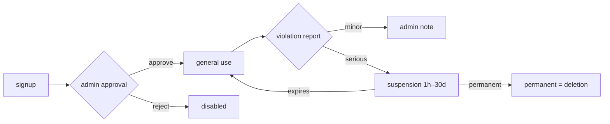

# Admin Features (Flutter Admin + Next.js Admin Web)

> 한국어: [admin-features.md](./admin-features.md)

Management functionality for `manager` / `admin` roles. Delivered through two channels: an in-app Flutter Admin screen, and a separate Next.js dashboard.

## Role System

| Role | Scope |
|---|---|
| `user` | General features |
| `manager` | User management (without full suspension powers) + all general features |
| `admin` | Everything (can promote other admins) |

**Validation**: `isAdminOrManager()` / `isAdmin()` helpers in `firestore.rules`. Cloud Functions re-check the Firestore `role` field at call time.

## Flutter Admin Screen

**Entry**: Settings → Admin (visible to manager/admin)

### ExpansionTile-Based Tabs

Five sections as collapsible `ExpansionTile` cards — collapsed tabs render nothing, so Firestore reads are 0 ([Technical Challenge #9](../guides/technical-challenges_en.md#9-admin-screen-firestore-read-overload-stream--future-transition)).

| Tab | Content |
|---|---|
| **Pending approval** | Users with `approved: false` → approve/reject |
| **Suspension** | Set duration (1h–30d) / immediate release |
| **Users** | Full search, role change, detail view |
| **Reports** | Reported posts/comments queue, moderation |
| **Deletion log** | Recent entries in `admin_logs` |
| **Feedback** | Change state (pending → acknowledged → resolved) |

### Manual Refresh After Actions

- Uses `FutureBuilder` (not `StreamBuilder`) → call `_refresh()` after each action
- **Result**: opening the screen dropped from 130+ reads to 20–30

**Files**: `lib/screens/board/admin_screen.dart`, `lib/screens/board/admin/users_tab.dart`

## Next.js Admin Web (`/admin-web`)

A browser-based dashboard sharing the same Firestore. Only `admin` role can enter.

### Pages

Under `admin-web/app/`:

| Path | Content |
|---|---|
| `dashboard/` | Stats cards (user count, reports, pending, etc.) |
| `users/` | User search / filter / approve / suspend / role change |
| `posts/` | Post search / delete |
| `comments/` | Comment moderation |
| `reports/` | Report queue |
| `feedbacks/` | Feedback state change |
| `crashes/` | Crashlytics log mirror in Firestore |
| `function-logs/` | Cloud Function error logs (`function_logs` collection) |
| `settings/` | Urgent popup, app version (`app_config`) |

### Common UX

- **Dark mode** toggle, mobile-responsive
- **Anonymous → real-name reveal** (admin-only, audit-logged)
- **Audit logging**: every admin action recorded in `admin_logs`

**Files**: `admin-web/app/`, `admin-web/components/`, `admin-web/lib/`

## Audit Log (`admin_logs`)

| Field | Example |
|---|---|
| `action` | `approve_user`, `suspend_user`, `change_role`, `delete_post`, `resolve_feedback` |
| `actorUid` | admin who performed the action |
| `targetUid` / `targetPostId` | subject |
| `detail` | JSON (before/after) |
| `createdAt` | timestamp |

Index: `action ASC, createdAt DESC` — Admin Web can filter by action type.

## Crash Monitoring

- **Crashlytics** baseline in Firebase Console
- Additionally, Cloud Functions errors are persisted in `function_logs`
- Admin Web `crashes/` pulls from Firestore for fast query / filter / delete

## Urgent Popup Management

- Edit `app_config/announcement` document
- Fields: `title`, `body`, `type` (`urgent` / `notice` / `event`), `startAt`, `endAt`, `hideToday`
- User-facing behavior → [public-features_en.md#urgent-popup-announcements](./public-features_en.md#urgent-popup-announcements)

## User-Management Flow

- **Auto-unsuspension**: Cloud Functions scheduler checks `suspendedUntil <= now` hourly → deletes the field → `onUserUpdated` trigger → unsuspension push

## See Also
- [Account & Access](../guides/account-and-access_en.md)
- [Security Model](../guides/security_en.md) — rules helpers, field validation
- [CI/CD Setup](../guides/cicd-setup_en.md)
- [Deployment Guide](https://github.com/Monkshark/hansol_hs_flutter_app/blob/master/DEPLOY_en.md)
