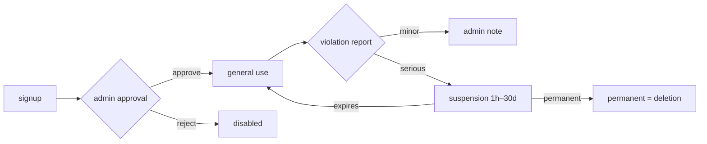

# Admin Features (Flutter Admin + Next.js Admin Web)

> 한국어: [admin-features.md](./admin-features.md)

Management functionality for `manager` / `admin` / `moderator` / `auditor` roles. Delivered through two channels: an in-app Flutter Admin screen, and a separate Next.js dashboard.

## Role System

| Role | Scope |
|---|---|
| `user` | General features |
| `moderator` | Delete posts/comments, read/process reports, write `admin_logs`. No access to user management, dashboard/stats, settings, or feedbacks |
| `auditor` | Read-only. Can read `admin_logs`, stats, reports, feedbacks, `crash_logs`, `function_logs`. Cannot delete anything or write `admin_logs` |
| `manager` | User management + all general features (cannot promote admins) |
| `admin` | Everything (can promote other admins) |

**Validation**: `isAdmin()` / `isAdminOrManager()` / `isModerator()` / `isAuditor()` / `isStaff()` helpers in `firestore.rules`. Cloud Functions re-check the Firestore `role` field at call time.

## Flutter Admin Screen

**Entry**: Settings → Admin (visible to staff roles only)

### ExpansionTile-Based Tabs

Sections are shown conditionally based on the user's role. Collapsed tabs render nothing, so Firestore reads are 0 ([Technical Challenge #9](../guides/technical-challenges_en.md#9-admin-screen-firestore-read-overload-stream--future-transition)).

| Tab | Content | Accessible By |
|---|---|---|
| **Pending approval** | Users with `approved: false` → approve/reject | manager, admin |
| **Suspension** | Set duration (1h–30d) / immediate release | manager, admin |
| **Users** | Full search, role change, detail view | manager, admin |
| **Reports** | Reported posts/comments queue, moderation | moderator, auditor (read-only), manager, admin |
| **Deletion log** | Recent entries in `admin_logs` | moderator, auditor (read-only), manager, admin |
| **Feedback** | Change state (pending → acknowledged → resolved) | auditor (read-only), manager, admin |
| **Appeals** | Review appeals (`appeals`) submitted by suspended users | manager, admin |
| **Data Requests** | Process data portability / access requests (`data_requests`) | manager, admin |
| **Community Rules** | Publish/edit `community_rules` versions | manager, admin |

### Manual Refresh After Actions

- Uses `FutureBuilder` (not `StreamBuilder`) → call `_refresh()` after each action
- **Result**: opening the screen dropped from 130+ reads to 20–30

**Role badge colors**: moderator = teal, auditor = purple

**Role change UI**: `users_tab.dart` uses a dropdown instead of toggle buttons for role assignment

**Files**: `lib/screens/board/admin_screen.dart`, `lib/screens/board/admin/users_tab.dart`

## Next.js Admin Web (`/admin-web`)

A browser-based dashboard sharing the same Firestore. All staff roles (admin/manager/moderator/auditor) can log in. The sidebar filters menu items by role via `canAccess()`.

### Pages

Under `admin-web/app/`:

| Path | Content |
|---|---|
| `dashboard/` | Stats cards (user count, reports, pending, etc.) |
| `users/` | User search / filter / approve / suspend / role change |
| `posts/` | Post search / delete |
| `comments/` | Comment moderation |
| `reports/` | Report queue |
| `feedbacks/` | Feedback state change |
| `crashes/` | Crashlytics log mirror in Firestore |
| `function-logs/` | Cloud Function error logs (`function_logs` collection) |
| `appeals/` | Suspension appeal review (`appeals`) |
| `data-requests/` | Data portability / access request handling (`data_requests`) |
| `community-rules/` | Publish rule versions (`community_rules`) |
| `admin-logs/` | Full `admin_logs` viewer — action group filter (role / delete / account / other) + search (all staff) |
| `settings/` | Urgent popup, app version (`app_config`) |

### Common UX

- **Dark mode** toggle, mobile-responsive
- **Anonymous → real-name reveal** (admin-only, audit-logged)
- **Audit logging**: every admin action recorded in `admin_logs`

**Files**: `admin-web/app/`, `admin-web/components/`, `admin-web/lib/`

## Audit Log (`admin_logs`)

Every admin action is recorded in `admin_logs`. Fields vary by action type; entries are auto-deleted after 30 days (`expiresAt` TTL).

### Common fields

| Field | Description |
|---|---|
| `action` | One of the action types below |
| `adminUid`, `adminName` | Actor |
| `createdAt` | Server timestamp |
| `expiresAt` | `createdAt + 30 days` (TTL policy) |

### Per-action extra fields

| `action` | Extra fields | Written by |
|---|---|---|
| `change_role` | `targetUid`, `targetName`, `previousRole`, `newRole` | Flutter `users_tab.dart`, Web `users/page.tsx` |
| `approve_user` / `reject_user` | `targetUid`, `targetName` | Flutter, Web |
| `suspend_user` | `targetUid`, `targetName`, `hours` | Flutter, Web |
| `unsuspend_user` | `targetUid`, `targetName` | Flutter, Web |
| `delete_user` | `targetUid`, `targetName` | Flutter, Web |
| `delete_post` | `postId`, `postTitle`, `postAuthorUid`, `postAuthorName` | Flutter `post_detail_actions_mixin.dart`, Web `posts/` |
| `delete_comment` | `postId`, `postTitle`, `commentId`, `commentContent`, `commentAuthorUid`, `commentAuthorName` | Web `comments/page.tsx` |
| `delete_feedback` | `feedbackType`, `feedbackContent`, `feedbackAuthorName` | Flutter `feedback_list_screen.dart` |
| `suspend` | `targetUid`, `reason`, `suspensionCount`, `days`, `actorUid` | Cloud Functions auto-suspend |

### How to view

- **Flutter**: Admin screen → Delete Logs tab (only `delete_post`, `delete_feedback`)
- **Admin Web**: `/admin-logs` — full action history with group filter (all / role / delete / account / other) and search; latest 200
- **Legacy compatibility**: Korean action strings (`'승인'`, `'거절'`, `'정지'`, `'정지 해제'`, `'삭제'`, `'역할 변경: xxx'`) from earlier entries still render correctly in the Admin Web viewer

### Permissions

- Create: `isModerator()` (admin / manager / moderator)
- Read: `isStaff()` (admin / manager / moderator / auditor)
- Update / delete: not allowed

## Crash Monitoring

- **Crashlytics** baseline in Firebase Console
- Additionally, Cloud Functions errors are persisted in `function_logs`
- Admin Web `crashes/` pulls from Firestore for fast query / filter / delete

## Urgent Popup Management

- Edit `app_config/announcement` document
- Fields: `title`, `body`, `type` (`urgent` / `notice` / `event`), `startAt`, `endAt`, `hideToday`
- User-facing behavior → [public-features_en.md#urgent-popup-announcements](./public-features_en.md#urgent-popup-announcements)

## User-Management Flow

- **Auto-unsuspension**: Cloud Functions scheduler checks `suspendedUntil <= now` hourly → deletes the field → `onUserUpdated` trigger → unsuspension push

## See Also
- [Account & Access](../guides/account-and-access_en.md)
- [Security Model](../guides/security_en.md) — rules helpers, field validation
- [CI/CD Setup](../guides/cicd-setup_en.md)
- [Deployment Guide](../DEPLOY_en.md)
