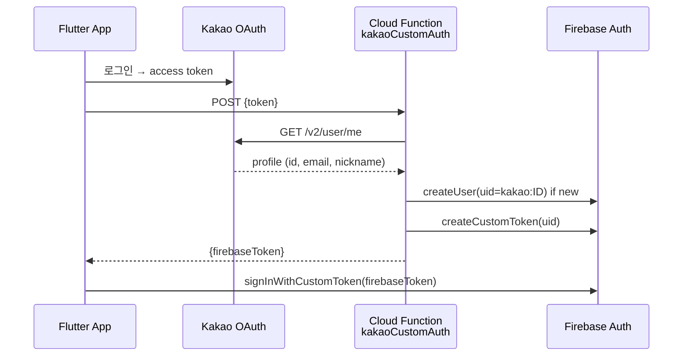
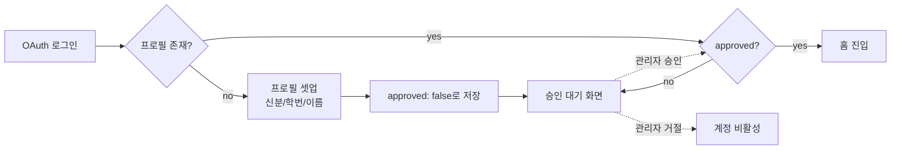

# 인증 & 접근 제어

> English: [account-and-access_en.md](./account-and-access_en.md)

한솔고 앱의 인증, 역할, 승인 플로우, 정지/탈퇴 절차를 정리합니다.

## 인증 방식 — 4종 OAuth

| Provider | 구현 방식 |
|---|---|
| **Google** | `google_sign_in` + Firebase Auth 직접 |
| **Apple** | `sign_in_with_apple` + Firebase Auth 직접 |
| **Kakao** | `kakao_flutter_sdk_user` → 자체 Cloud Function (`kakaoCustomAuth`) → Firebase Custom Token |
| **GitHub** | Firebase Auth OAuth provider |

비밀번호는 저장하지 않습니다. 각 Provider의 OAuth token만 사용.

### Kakao 커스텀 토큰 플로우

- zod 스키마로 입력 검증 (`KakaoAuthSchema`)
- 프로필 사진은 Firestore `users/{uid}.profilePhotoUrl` 에 저장 (없는 경우만)

## 신분 (`userType`)

가입 시 선택:
- `student` — 재학생 (학번 입력 필수)
- `alumni` — 졸업생
- `teacher` — 교사
- `parent` — 학부모

신분에 따라 기본 역할 = `user`. 이후 관리자 승인 절차.

## 역할 체계

| `role` | 권한 |
|---|---|
| `user` | 일반 기능 (승인 후) |
| `manager` | 사용자 관리 + 콘텐츠 모더레이션 (정지 권한 제한) |
| `admin` | 모든 권한 (역할 부여 포함) |

**승급/강등**: `admin`만 가능. 감사 로그(`admin_logs`)에 이전→이후 기록.

## 가입 & 승인 플로우

- 승인 대기 중에는 일반 기능 차단 (규칙 + 클라이언트 가드)
- 관리자가 Admin 화면에서 승인 → `onUserUpdated` 트리거 → 승인 푸시

## 정지 & 해제

- **정지 기간**: 1시간 / 6시간 / 1일 / 3일 / 7일 / 30일 / 영구
- 필드: `users/{uid}.suspendedUntil` (timestamp)
- 정지 중에는 글/댓글/채팅 작성 차단 (rules + 클라이언트)

### 자동 해제

Cloud Functions 스케줄러 (`checkSuspensionExpiry`, 매시간):
1. `suspendedUntil <= now` 조회
2. 필드 삭제
3. `onUserUpdated` 트리거 → 해제 푸시 발송

## 탈퇴

이중 확인 다이얼로그 → 완전 삭제:
1. 하위 컬렉션 (`users/{uid}/{subjects,sync,notifications}`) 삭제
2. `users/{uid}` 문서 삭제 (인증 상태 유지 중)
3. Cloud Storage 프로필 사진 삭제
4. `user.delete()` — Auth 계정 삭제

순서가 중요: Auth 먼저 삭제 시 Firestore에서 PERMISSION_DENIED ([기술과제 #10](./technical-challenges.md#10-계정-삭제-순서-문제)).

## 로그인 상태 이슈

### 토큰 전파 지연

OAuth 직후 Firestore 접근 시 PERMISSION_DENIED 가능. `getIdToken(true)`로 강제 갱신 + 최대 3회 재시도 ([기술과제 #1](./technical-challenges.md#1-firebase-auth-토큰-동기화-문제)).

### 새 학기 업데이트

재학생/교사는 3월에 학년/반/번호 입력 팝업 표시. 역할은 변경 불가.

## 역할별 기능 매트릭스

| 기능 | user | manager | admin |
|---|:---:|:---:|:---:|
| 글/댓글 작성 | ✅ | ✅ | ✅ |
| 글/댓글 삭제 (타인) | ❌ | ✅ | ✅ |
| 사용자 승인 | ❌ | ✅ | ✅ |
| 사용자 정지 | ❌ | ❌ (설정에 따라) | ✅ |
| 역할 변경 | ❌ | ❌ | ✅ |
| 공지 고정 | ❌ | ✅ | ✅ |
| 긴급 팝업 관리 | ❌ | ❌ | ✅ |
| Admin Web 접근 | ❌ | ✅ | ✅ |
| 신고 처리 | ❌ | ✅ | ✅ |
| 감사 로그 조회 | ❌ | ✅ (읽기) | ✅ |

상세 규칙은 [security.md](./security.md) 참조.

## 관련 문서
- [보안 모델](./security.md)
- [관리자 기능](../features/admin-features.md)
- [데이터 모델](./data-model.md) — `users` 스키마 상세
- [엔드유저 가이드](https://github.com/Monkshark/hansol_hs_flutter_app/blob/master/USER_GUIDE.md)
