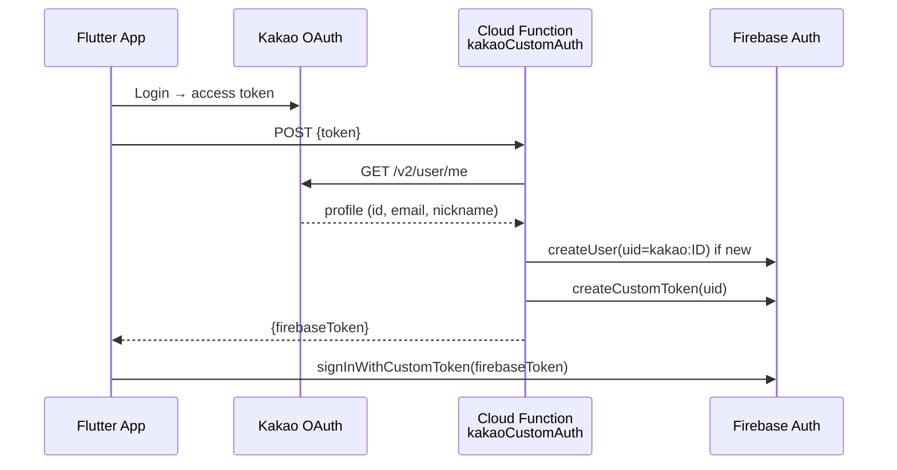
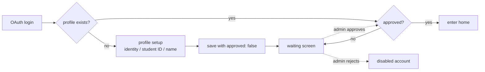
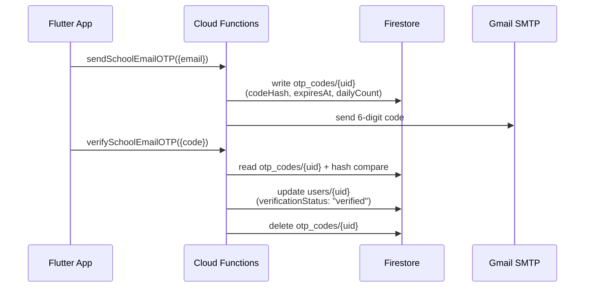

# Account & Access Control

> 한국어: [account-and-access.md](./account-and-access.md)

Authentication, roles, approval flow, and suspension/deletion procedures for the Hansol HS app.

## Authentication — 4 OAuth Providers

| Provider | Implementation |
|---|---|
| **Google** | `google_sign_in` + Firebase Auth direct |
| **Apple** | `sign_in_with_apple` + Firebase Auth direct |
| **Kakao** | `kakao_flutter_sdk_user` → custom Cloud Function (`kakaoCustomAuth`) → Firebase custom token |
| **GitHub** | Firebase Auth OAuth provider |

No passwords are ever stored — only OAuth tokens.

### Kakao Custom Token Flow



- Zod schema (`KakaoAuthSchema`) validates input
- Profile picture saved to Firestore `users/{uid}.profilePhotoUrl` only if missing

## Identity (`userType`)

Chosen at signup:
- `student` — current student (student ID required)
- `alumni` — graduate
- `teacher` — teacher
- `parent` — parent/guardian

Default `role = user` regardless of identity. Admin approval follows.

## Roles

| `role` | Headcount | Who | Scope |
|---|---|---|---|
| `admin` | 1-2 | Supervising teacher | Full access, role assignment |
| `manager` | 2-3 | Student council president/VP | User management, content deletion, report handling, settings |
| `moderator` | 5-7 | General student council officers | Post/comment deletion, report review/handling |
| `auditor` | 1 | Graduate developer / supervising teacher | Read-only auditor — view logs, stats, reports, suggestions |
| `user` | — | General users | General features (after approval) |

`admin`, `manager`, `moderator`, and `auditor` are collectively referred to as **staff**.

**Flutter model** (`UserProfile`):
- New getters: `isModerator`, `isAuditor`, `isStaff`
- `isApproved()` — staff (`isStaff`) bypass approval (previously checked `isManager`)
- Home screen admin shield button — shown based on `isStaff` (previously `isManager`)

**Promotion/demotion**: admin-only. Each change is logged in `admin_logs` (before → after).

## Signup & Approval Flow



- Un-approved users are blocked from most features (rules + client guards)
- Admin approval via Admin screen → `onUserUpdated` trigger → approval push

## School Email Verification (OTP)

PIPA youth-data requirements plus the need to keep outsiders out: identity is confirmed via a school-issued email domain.

**Allowed domains**: `edu.sje.go.kr`, `sjhansol.sjeduhs.kr` (Functions constant `SCHOOL_EMAIL_DOMAINS`)

### Flow



### State fields (`users/{uid}`)

| Field | Value |
|---|---|
| `verificationStatus` | `pending` (right after signup) / `verified` (on success) |
| `schoolEmail` | the verified address |
| `verifiedAt` | server timestamp |
| `verifiedVia` | `otp` |

On signup, `ProfileSetupScreen` writes `verificationStatus: 'pending'` and immediately pushes the verification screen (`dismissible: false`).

### Security / rate limits

| Item | Value | Location |
|---|---|---|
| Code length | 6 digits | `crypto.randomInt(0, 1000000)` |
| Storage | sha256 hash | plaintext never persisted |
| Expiry | 30 minutes | `expiresAt` |
| Resend interval | 120 seconds | compared against `lastSentAt` |
| Daily send cap | 5 | `dailyKey` + `dailyCount` |
| Attempt cap | 5 | `attempts` counter → OTP deleted on excess |
| Success / expiry | OTP deleted immediately | non-reusable |

The `otp_codes/{uid}` collection denies all client read/write (Cloud Functions only). See [security_en.md#new-collections-pipa](./security_en.md#new-collections-pipa).

### `isVerified()` guard

```js
function canWrite() { return isVerified() && isNotSuspended(); }
```

`posts` / `comments` / `reports` / `chats/messages` creates require `canWrite()`. Unverified users cannot post, comment, report, or chat.

**Grandfathering**: pre-existing users without a `verificationStatus` field are treated as `'verified'` (`data.get('verificationStatus', 'verified')`). Only new signups go through verification.

### Client guard

`VerificationGuard.check()` (`lib/providers/verification_guard.dart`) is invoked at write/comment/report entry points:
- Suspended → suspension dialog + appeal entry
- Unverified → verification prompt → "Verify" pushes `EmailVerificationScreen` → on success, invalidates `userProfileProvider`

### Functions secrets

`GMAIL_SENDER_EMAIL` and `GMAIL_APP_PASSWORD` are stored as Functions secrets and used to send via Gmail SMTP (app password). After enabling Blaze, register via `firebase functions:secrets:set`.

**Files**: `functions/index.js` (`sendSchoolEmailOTP`, `verifySchoolEmailOTP`), `lib/screens/auth/email_verification_screen.dart`, `lib/providers/verification_guard.dart`

## Suspension & Unsuspension

- **Durations**: 1h / 6h / 1d / 3d / 7d / 30d / permanent
- Field: `users/{uid}.suspendedUntil` (timestamp)
- During suspension, post/comment/chat creation is blocked (rules + client)

### Auto-Unsuspension

Cloud Functions scheduler (`checkSuspensionExpiry`, hourly):
1. Query `suspendedUntil <= now`
2. Delete the field
3. `onUserUpdated` trigger → unsuspension push

## Deletion

Double confirmation, then full wipe:
1. Delete subcollections (`users/{uid}/{subjects,sync,notifications}`)
2. Delete `users/{uid}` document (while still authed)
3. Delete profile picture from Cloud Storage
4. `user.delete()` — delete Auth account

Order matters: deleting Auth first causes Firestore PERMISSION_DENIED ([Technical Challenge #10](./technical-challenges_en.md#10-account-deletion-ordering-auth--firestore-permission-loss)).

## Login-State Gotchas

### Token Propagation

Firestore access right after OAuth may fail with PERMISSION_DENIED. We force-refresh via `getIdToken(true)` and retry up to 3 times ([Technical Challenge #1](./technical-challenges_en.md#1-firebase-auth-token-propagation-permission-denied)).

### March School-Year Update

Students/teachers see a popup in March to update year/class/number. Identity is not user-changeable.

## Role-feature Matrix

| Feature | user | moderator | auditor | manager | admin |
|---|:---:|:---:|:---:|:---:|:---:|
| Create post/comment | ✅ | ✅ | ❌ | ✅ | ✅ |
| Delete others' post/comment | ❌ | ✅ | ❌ | ✅ | ✅ |
| View/handle reports | ❌ | ✅ | View only | ✅ | ✅ |
| Approve users | ❌ | ❌ | ❌ | ✅ | ✅ |
| Suspend users | ❌ | ❌ | ❌ | ✅ | ✅ |
| Change roles | ❌ | ❌ | ❌ | ❌ | ✅ |
| Pin announcements | ❌ | ❌ | ❌ | ✅ | ✅ |
| Manage urgent popup | ❌ | ❌ | ❌ | ✅ | ✅ |
| Manage settings | ❌ | ❌ | ❌ | ✅ | ✅ |
| View logs/stats | ❌ | ❌ | ✅ | ✅ | ✅ |
| View suggestions | ❌ | ❌ | ✅ | ✅ | ✅ |
| Admin screen access | ❌ | ✅ | ✅ | ✅ | ✅ |
| View audit logs | ❌ | ❌ | ✅ | ✅ | ✅ |

Full rules detail: [security_en.md](./security_en.md).

## See Also
- [Security Model](./security_en.md)
- [Admin Features](../features/admin-features_en.md)
- [Data Model](./data-model_en.md) — full `users` schema
- [User Guide](../USER_GUIDE_en.md)
