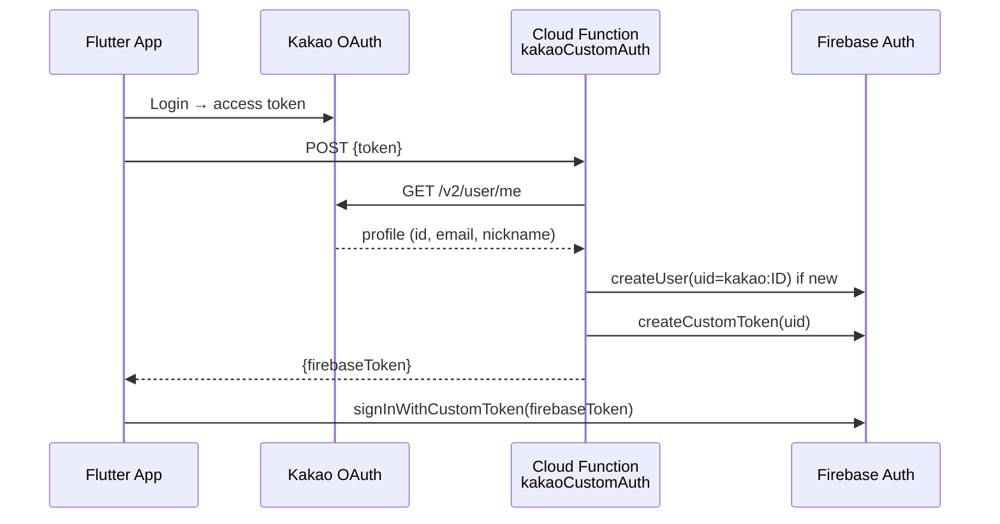
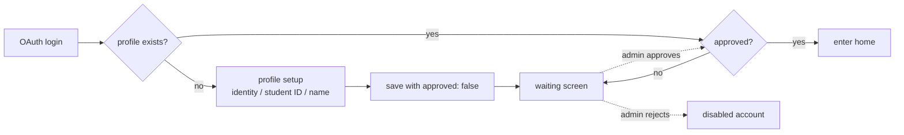

# Account & Access Control

> 한국어: [account-and-access.md](./account-and-access.md)

Authentication, roles, approval flow, and suspension/deletion procedures for the Hansol HS app.

## Authentication — 4 OAuth Providers

| Provider | Implementation |
|---|---|
| **Google** | `google_sign_in` + Firebase Auth direct |
| **Apple** | `sign_in_with_apple` + Firebase Auth direct |
| **Kakao** | `kakao_flutter_sdk_user` → custom Cloud Function (`kakaoCustomAuth`) → Firebase custom token |
| **GitHub** | Firebase Auth OAuth provider |

No passwords are ever stored — only OAuth tokens.

### Kakao Custom Token Flow

- Zod schema (`KakaoAuthSchema`) validates input
- Profile picture saved to Firestore `users/{uid}.profilePhotoUrl` only if missing

## Identity (`userType`)

Chosen at signup:
- `student` — current student (student ID required)
- `alumni` — graduate
- `teacher` — teacher
- `parent` — parent/guardian

Default `role = user` regardless of identity. Admin approval follows.

## Roles

| `role` | Scope |
|---|---|
| `user` | General features (after approval) |
| `manager` | User management + content moderation (limited suspension) |
| `admin` | Everything (including granting roles) |

**Promotion/demotion**: admin-only. Each change is logged in `admin_logs` (before → after).

## Signup & Approval Flow

- Un-approved users are blocked from most features (rules + client guards)
- Admin approval via Admin screen → `onUserUpdated` trigger → approval push

## Suspension & Unsuspension

- **Durations**: 1h / 6h / 1d / 3d / 7d / 30d / permanent
- Field: `users/{uid}.suspendedUntil` (timestamp)
- During suspension, post/comment/chat creation is blocked (rules + client)

### Auto-Unsuspension

Cloud Functions scheduler (`checkSuspensionExpiry`, hourly):
1. Query `suspendedUntil <= now`
2. Delete the field
3. `onUserUpdated` trigger → unsuspension push

## Deletion

Double confirmation, then full wipe:
1. Delete subcollections (`users/{uid}/{subjects,sync,notifications}`)
2. Delete `users/{uid}` document (while still authed)
3. Delete profile picture from Cloud Storage
4. `user.delete()` — delete Auth account

Order matters: deleting Auth first causes Firestore PERMISSION_DENIED ([Technical Challenge #10](./technical-challenges_en.md#10-account-deletion-ordering-auth--firestore-permission-loss)).

## Login-State Gotchas

### Token Propagation

Firestore access right after OAuth may fail with PERMISSION_DENIED. We force-refresh via `getIdToken(true)` and retry up to 3 times ([Technical Challenge #1](./technical-challenges_en.md#1-firebase-auth-token-propagation-permission-denied)).

### March School-Year Update

Students/teachers see a popup in March to update year/class/number. Identity is not user-changeable.

## Role-feature Matrix

| Feature | user | manager | admin |
|---|:---:|:---:|:---:|
| Create post/comment | ✅ | ✅ | ✅ |
| Delete others' post/comment | ❌ | ✅ | ✅ |
| Approve users | ❌ | ✅ | ✅ |
| Suspend users | ❌ | ✅ | ✅ |
| Change roles | ❌ | ❌ | ✅ |
| Pin announcements | ❌ | ✅ | ✅ |
| Manage urgent popup | ❌ | ✅ | ✅ |
| Admin Web access | ❌ | ✅ | ✅ |
| Handle reports | ❌ | ✅ | ✅ |
| Read/write audit logs | ❌ | ✅ | ✅ |

Full rules detail: [security_en.md](./security_en.md).

## See Also
- [Security Model](./security_en.md)
- [Admin Features](../features/admin-features_en.md)
- [Data Model](./data-model_en.md) — full `users` schema
- [User Guide](https://github.com/Monkshark/hansol_hs_flutter_app/blob/master/USER_GUIDE_en.md)
