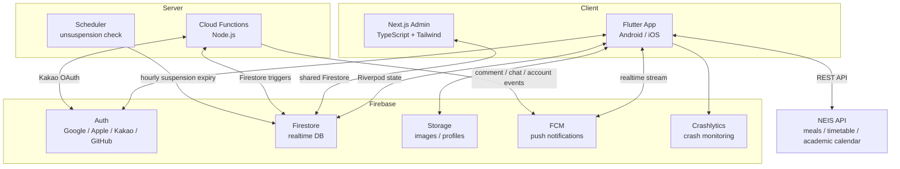
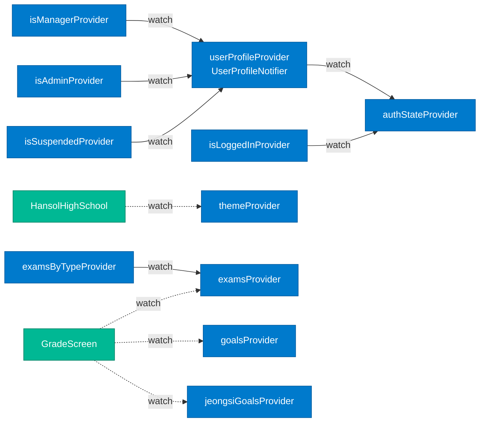
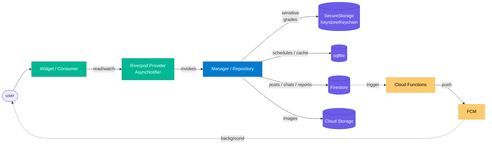

# Architecture Overview

> 한국어: [architecture-overview.md](./architecture-overview.md)

Hansol HS App is a **dual-client** architecture — a Flutter mobile app and a Next.js admin dashboard — sharing a common **Firebase** backend. This document covers the full system picture, the Riverpod state graph, and the layered data-flow model.

## System Diagram



### Components

| Component | Location | Role |
|---|---|---|
| **Flutter App** | `/lib` | Main user UI. Single codebase for Android/iOS |
| **Next.js Admin** | `/admin-web` | Web-based admin dashboard sharing the same Firestore |
| **Admin Static** | `/admin-static` | Legacy static admin page |
| **Cloud Functions** | `/functions/index.js` | Kakao OAuth custom tokens, push triggers, scheduler |
| **Android Widget** | `/android/.../widget` | Home widgets (meal / timetable / combined) |
| **iOS Widget** | `/ios/Widget*` | WidgetKit home widgets |

## Flutter Layer Layout

```
lib/
├── main.dart                # App entry
├── api/                     # External REST API wrappers (NEIS, etc.)
├── data/                    # Static constants / shared data (days, grade cutoffs)
├── network/                 # Firestore / Storage access layer
├── notification/            # FCM tokens, in-app notifications, local notifications
├── providers/               # Riverpod global providers (auth, grade, settings, theme)
├── screens/                 # Screens (auth, board, chat, main, sub)
├── styles/                  # Theme, colors, text styles
└── widgets/                 # Reusable stateless widgets
```

### Dependency Direction
- **screens → providers → network/api** (one-way)
- **screens do not call `network/` directly** (go via provider)
- **widgets are data-agnostic pure UI** (Stateless)

## Riverpod Provider Graph

Auto-generated via `riverpod_graph` CLI. The mermaid below is a summary — full version at **🔗 [Interactive](https://monkshark.github.io/hansol_hs_flutter_app/riverpod_graph.html)** (D3.js zoom/drag). Source HTML stored at `docs/riverpod_graph.html`.



### Derivation Rules
- `authStateProvider` is the root of the **auth state tree**: profile → roles (moderator/auditor/manager/admin/suspended) derived downstream — roles read directly from Firebase Auth custom claims
- `examsByTypeProvider` (susi/jeongsi split) derives from `examsProvider`
- Consumers `watch` only the leaf providers they need → avoid unnecessary rebuilds
- `autoDispose` is used aggressively so providers clean up when screens unmount

### Provider Types
- **Sync Notifier** (`theme`, `isLoggedIn`): simple state transitions
- **AsyncNotifier** (`userProfile`, `exams`, `goals`): async load from Firestore / SecureStorage
- **Derived Provider** (`isManager`, `examsByType`): only transforms other providers

## Data Flow (Layered Model)



### Principles
- **Widgets only depend on Providers** — Managers/stores are encapsulated behind providers
- Four storage backends chosen by **sensitivity / access pattern** → [ADR-06](./architecture-decisions_en.md#adr-06-storage-allocation)
- Writes → Firestore triggers → Cloud Functions → FCM form the **async push pipeline**
- Widgets can mock notifiers via `ProviderScope.overrides` in tests

## Storage Allocation

| Store | Purpose | Rationale |
|---|---|---|
| **sqflite** | Personal schedules (time/color/span) | row-level range queries + offline-first |
| **Firestore** | Posts / comments / chats / reports / user profiles | realtime sync + multi-client + Cloud Functions triggers |
| **SecureStorage** | Grades | OS-level encryption + fully local (never uploaded) |
| **Cloud Storage** | Post / profile images | CDN + direct download URLs |
| **SharedPreferences** | Settings / cache / search history | simple key-value, fast reads |

Each store has one clear responsibility → "where does this data live?" is never ambiguous.

## Dual Client: Flutter ↔ Admin Web

| Aspect | Flutter (`/lib`) | Admin Web (`/admin-web`) |
|---|---|---|
| **Language** | Dart | TypeScript |
| **UI framework** | Flutter Material | Next.js 14 + Tailwind CSS |
| **State** | Riverpod 2.5 | React hooks + SWR |
| **Auth** | Firebase Auth SDK (mobile) | Firebase Auth (web) + role check |
| **Audience** | students / teachers / parents / alumni | moderator/auditor/manager/admin roles only (4 tiers) |
| **Shared** | same Firestore collections (`users`, `posts`, ...) | same |

**Conflict prevention**: Admin Web UPDATE permissions enforce `isManager()` / `isAdmin()` / `isAuditor()` helpers from `firestore.rules`. All role checks read from `request.auth.token.role` (Firebase Auth custom claims) → zero extra Firestore reads. Rules remain the single source of truth regardless of client.

## Cloud Functions Trigger Map

| Function | Trigger | Role |
|---|---|---|
| `kakaoCustomAuth` | HTTPS onRequest | Kakao access token → Firebase custom token |
| `sendSchoolEmailOTP` / `verifySchoolEmailOTP` | onCall | School email OTP issue / verify (teacher onboarding) |
| `redeemTeacherInvite` | onCall | Redeem teacher invite code (`teacher` userType + auto-approve) |
| `postOgRenderer` | HTTPS onRequest | Render OG-tagged HTML for deep links |
| `onCommentCreated` | `posts/{pid}/comments/{cid}` onCreate | push to post author + stat increment |
| `onPostCreated` | `posts/{pid}` onCreate | push to admins (per-category opt-in) + `app_stats/totals.posts++` |
| `onPostLikeUpdated` | `posts/{pid}` onUpdate | detect like count changes, correct popular-post counter |
| `onReportCreated` | `reports/{rid}` onCreate | push to admins on report + write log + stat increment |
| `aggregateReports` | `reports/{rid}` onCreate | Burst detection (multiple reports on same target within 5min) → manager alert |
| `onUserCreated` | `users/{uid}` onCreate | initialize user, grant custom claims (`role: "user"`, `approved: false`) |
| `onUserUpdated` | `users/{uid}` onUpdate | push on approval / role / suspension change + claim refresh |
| `onUserDeleted` | `users/{uid}` onDelete | cascade delete Auth account + Storage files |
| `onChatMessageCreated` | `chats/{cid}/messages/{mid}` onCreate | push to recipient |
| `checkSuspensionExpiry` | onSchedule (hourly) | delete `suspendedUntil` when expired → cascades `onUserUpdated` |
| `applyProgressiveSuspension` | onCall | Progressive suspension (1st: 1d → 2nd: 7d → 3rd: 30d) — manager only |
| `requestAccountDeletion` | onCall | User-initiated account deletion (deferred 30-day purge) |
| `purgeDeactivatedAccounts` | onSchedule (daily 04:00) | Permanently destroy accounts past 30-day deletion window |
| `createDataExport` | onCall | Export user's own data (posts/comments/reports/chats) as JSON → Storage |
| `purgeExpiredExports` | onSchedule (daily 05:00) | Sweep expired `data_requests` export files |
| `cleanupOldPosts` | onSchedule (daily 18:00) | TTL cleanup for stale reports/logs |
| `promoteGradesAnnually` | onSchedule (yearly Mar-2 00:00) | Auto-promote grades + graduate handoff |
| `backfillStats` | HTTPS onRequest | Recompute counters from full collection scan (manual tool) |
| `backfillCustomClaims` | HTTPS onRequest | Re-grant custom claims to existing users (admin tool) |

Full code in `functions/index.js`.

## See Also
- [Architecture Decisions (ADRs)](./architecture-decisions_en.md)
- [Data Model](./data-model_en.md)
- [Security Model](./security_en.md)
- [Testing Strategy](./testing_en.md)
