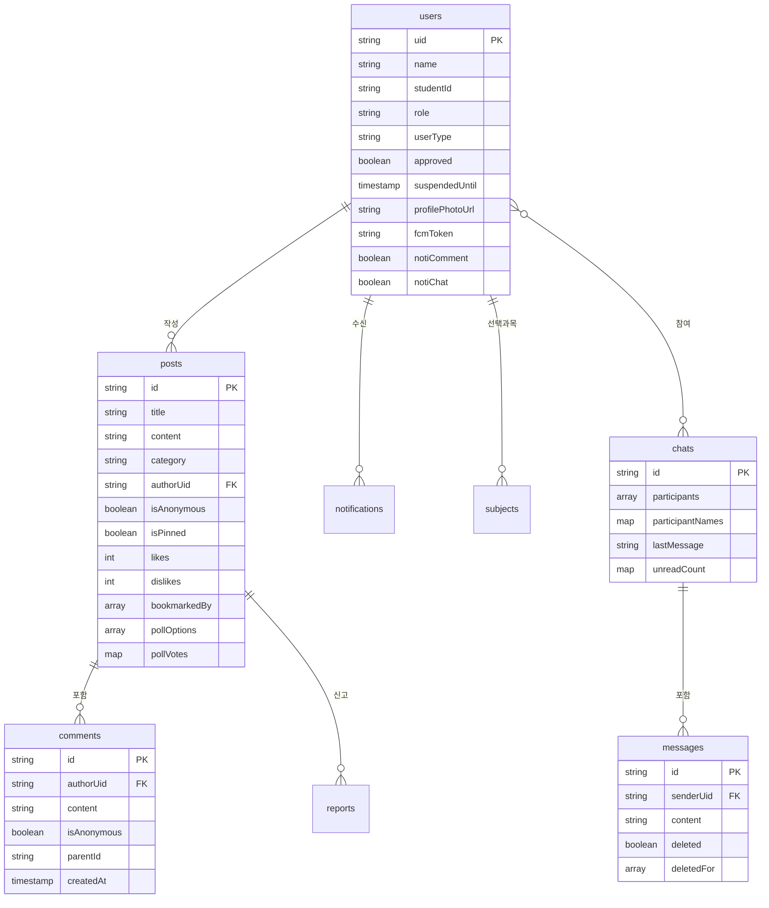

# 데이터 모델

> English: [data-model_en.md](./data-model_en.md)

Firestore 컬렉션 구조, 필드 스키마, 인덱스, 보안 규칙 연관을 한 곳에 정리합니다.

## ERD

## 컬렉션 상세

### `users/{uid}`

| 필드 | 타입 | 설명 |
|---|---|---|
| `uid` | string (doc id) | Firebase Auth UID 또는 `kakao:{id}` |
| `name` | string | 실명 |
| `studentId` | string | 학번 (재학생) |
| `userType` | string | `student` / `graduate` / `teacher` / `parent` |
| `role` | string | `user` / `moderator` / `auditor` / `manager` / `admin` |
| `approved` | boolean | 관리자 승인 여부 |
| `verificationStatus` | string | `pending` / `verified` (학교 이메일 OTP 인증 결과). 필드 없으면 `verified`로 grandfathered |
| `schoolEmail` | string | 인증된 학교 이메일 (성공 시 기록) |
| `verifiedAt` | timestamp | 인증 완료 시각 |
| `verifiedVia` | string | 인증 경로 (`otp`) |
| `suspendedUntil` | timestamp \| null | 정지 만료 시각. 스케줄러가 매시간 청소 |
| `suspendReason` | string \| null | 정지 사유 (배너 표시용) |
| `blockedUsers` | string[] | 차단한 사용자 uid 목록 |
| `lastProfileUpdate` | string | "YYYY" 형식 — 새 학기 학년/반/번호 갱신 추적 |
| `graduationYear` | int \| null | 졸업생만 |
| `teacherSubject` | string \| null | 교사만 (담당 과목) |
| `loginProvider` | string | `google` / `apple` / `kakao` / `github` |
| `profilePhotoUrl` | string | Cloud Storage 또는 OAuth 프로필 |
| `fcmToken` | string | FCM 푸시 타겟 |
| `notiComment` / `notiReply` / `notiChat` / `notiNewPost` / `notiAccount` | boolean | 카테고리별 알림 on/off |
| `createdAt` / `updatedAt` | timestamp | 감사용 |

**보안 규칙 요약** (`firestore.rules`):
- `read`: 본인 또는 manager/admin
- `update`: 본인(단 `role`, `suspendedUntil`, `approved` 불변) 또는 manager/admin
- `delete`: 본인 또는 admin

**서브컬렉션**:
- `users/{uid}/subjects/{doc}` — 선택과목 (본인만 read/write)
- `users/{uid}/sync/{doc}` — 동기화 메타 (본인만 read/write)
- `users/{uid}/notifications/{notifId}` — 인앱 알림 (본인만 read/update/delete; create는 누구나 — 관리자 알림 허용)

### `posts/{postId}`

| 필드 | 타입 | 설명 |
|---|---|---|
| `title` | string (1~200자) | 제목 |
| `content` | string (≤5000자) | 본문 |
| `category` | string | 6카테고리 중 하나 |
| `authorUid` | string | 작성자 |
| `isAnonymous` | boolean | 익명 여부 |
| `isPinned` / `pinnedAt` | boolean / timestamp | 공지 고정 (최대 3개) |
| `likes` / `dislikes` | map<uid,bool> | 토글용 |
| `likeCount` / `dislikeCount` | int | 정렬용 비정규화 |
| `bookmarkedBy` | array<string> | 북마크 사용자 |
| `pollOptions` | array<string> | 투표 선택지 (최대 6) |
| `pollVoters` | map<uid,int> | 사용자별 선택 인덱스 |
| `searchTokens` | array<string> | 2-gram 검색 토큰 (≤200) |
| `anonymousMapping` / `anonymousCount` | map / int | 익명 번호제 |
| `commentCount` | int | 댓글 수 비정규화 |
| `imageUrls` | array<string> | 첨부 이미지 |
| `createdAt` / `updatedAt` | timestamp | — |

**보안 규칙 요약**:
- `read`: 모두 허용
- `create`: 인증 + `authorUid == auth.uid` + 제목/본문 길이 검증
- `update`: 작성자 자유 수정 OR 비작성자는 `isInteractionUpdate()` 필드만 (`likes`, `dislikes`, `likeCount`, `dislikeCount`, `pollVoters`, `commentCount`, `anonymousMapping`, `anonymousCount`, `bookmarkedBy`) + `validCounterDelta(±1)`
- `delete`: 작성자 또는 manager/admin (감사 로그 기록)

**서브컬렉션**:
- `posts/{postId}/comments/{commentId}` — 댓글/대댓글

### `chats/{chatId}`, `chats/{chatId}/messages/{messageId}`

| 필드 | 타입 | 설명 |
|---|---|---|
| `participants` | array<string> | 참여자 uid (2명) |
| `participantNames` | map<uid,string> | 캐시된 이름 |
| `lastMessage` | string | 목록 미리보기 |
| `lastMessageAt` | timestamp | 정렬용 |
| `unreadCount` | map<uid,int> | 사용자별 안 읽은 수 |

메시지:
- `senderUid`, `content`, `createdAt`, `deleted: boolean`, `deletedFor: array<uid>`

**보안 규칙 요약**: 참여자만 read/write. 메시지 update는 삭제 기능(`deleted`, `deletedFor` 필드만) 허용.

### `reports/{reportId}`

- 필드: `postId`, `reporterUid`, `reason`, `createdAt`, `status`
- `read`: 관리자 전용
- `create`: 인증 사용자 (동일 `(postId, reporterUid)` 중복 방지 인덱스)

### `admin_logs/{logId}`

- 관리 행위 감사 로그: `action`, `actorUid`, `targetUid` / `targetPostId`, `createdAt`, `detail`
- `read/write`: 관리자 전용

### `function_logs/{logId}`

- Cloud Functions 오류 기록 (`function`, `error`, `code`, `stack`, `createdAt`)
- `write`: Functions만 (admin SDK), `read`: 관리자

### `app_config/{key}`

- `version`: 최소/최신 앱 버전
- `announcement`: 긴급 팝업 공지 설정
- `read`: 모두, `write`: 관리자

## 인덱스

`firestore.indexes.json`의 복합 인덱스 총 9개:

| 컬렉션 | 필드 | 용도 |
|---|---|---|
| `posts` | `category ASC, createdAt DESC` | 카테고리별 최신 글 |
| `posts` | `authorUid ASC, createdAt DESC` | 내 글 목록 |
| `posts` | `bookmarkedBy CONTAINS, createdAt DESC` | 북마크 글 목록 |
| `posts` | `isPinned ASC, pinnedAt DESC` | 공지 정렬 |
| `posts` | `likeCount DESC, createdAt DESC` | **인기글 정렬** (ADR-04) |
| `chats` | `participants CONTAINS, lastMessageAt DESC` | 채팅 목록 |
| `admin_logs` | `action ASC, createdAt DESC` | 관리 로그 필터 |
| `reports` | `postId ASC, reporterUid ASC` | 중복 신고 방지 |
| `reports` | `reporterUid ASC, createdAt ASC` | 내 신고 히스토리 |

## 로컬 저장소

### sqflite (`lib/data/local_database.dart`)
- `schedules`: `id`, `title`, `startDate`, `endDate`, `color`, `repeatRule`
- `ddays`: `id`, `title`, `targetDate`, `pinned`

### SecureStorage
- 키: `exams_json`, `goals_json`, `jeongsi_goals_json`
- 값: JSON 직렬화된 성적/목표
- 마이그레이션 로그: `sp_to_secure_migrated: "1"`

### SharedPreferences
- `theme_mode`, `notification_time_breakfast`, `search_history`, `timetable_cache_{YYYYMMDD}` 등

## 관련 문서
- [보안 모델](./security.md) — rules 헬퍼 함수 상세
- [ADR-04](./architecture-decisions.md#adr-04-좋아요-카운터) — 카운터 스키마 설계 근거
