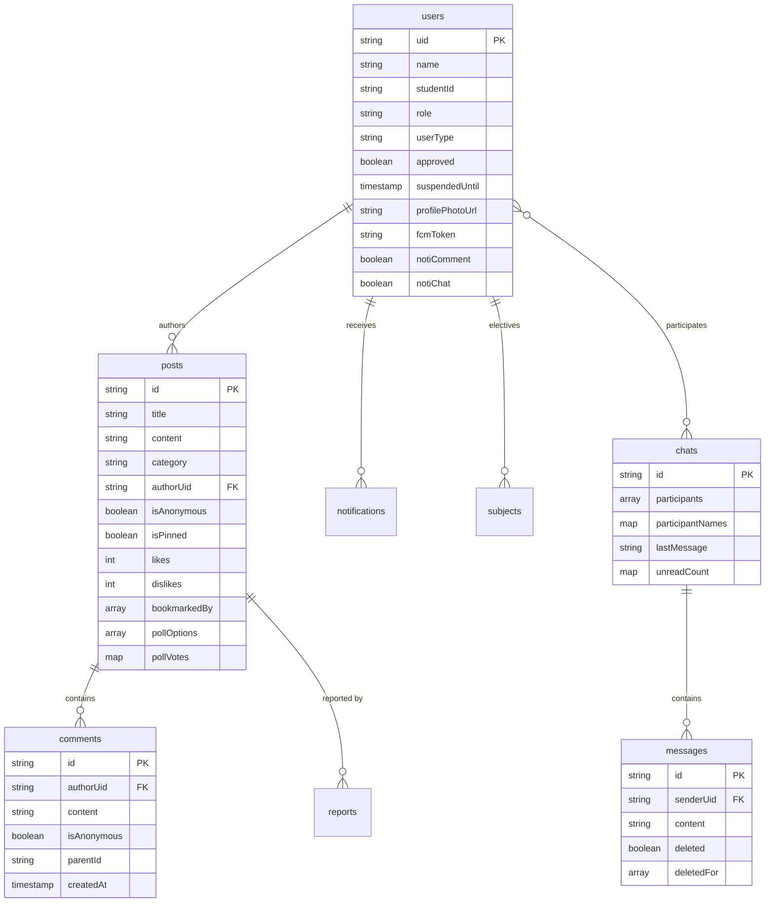

# Data Model

> 한국어: [data-model.md](./data-model.md)

Firestore collection layout, field schema, indexes, and security-rule relationships in one place.

## ERD

## Collections

### `users/{uid}`

| Field | Type | Notes |
|---|---|---|
| `uid` | string (doc id) | Firebase Auth UID, or `kakao:{id}` for Kakao users |
| `name` | string | real name |
| `studentId` | string | student number (students/alumni) |
| `userType` | string | `student` / `alumni` / `teacher` / `parent` |
| `role` | string | `user` / `moderator` / `auditor` / `manager` / `admin` |
| `approved` | boolean | admin-approved flag |
| `suspendedUntil` | timestamp \| null | expiry; scheduler clears hourly |
| `profilePhotoUrl` | string | Cloud Storage or OAuth profile |
| `fcmToken` | string | FCM push target |
| `notiComment` / `notiReply` / `notiChat` / `notiNewPost` / `notiAccount` | boolean | per-category toggles |
| `createdAt` / `updatedAt` | timestamp | audit |

**Rules summary** (`firestore.rules`):
- `read`: self or manager/admin
- `update`: self (but `role`, `suspendedUntil`, `approved` immutable) or manager/admin
- `delete`: self or admin

**Subcollections**:
- `users/{uid}/subjects/{doc}` — electives (self-only read/write)
- `users/{uid}/sync/{doc}` — sync metadata (self-only)
- `users/{uid}/notifications/{notifId}` — in-app notifications (self reads/updates/deletes; anyone may create — allows admin alerts)

### `posts/{postId}`

| Field | Type | Notes |
|---|---|---|
| `title` | string (1–200) | post title |
| `content` | string (≤5000) | body |
| `category` | string | one of 6 categories |
| `authorUid` | string | author |
| `isAnonymous` | boolean | anonymous flag |
| `isPinned` / `pinnedAt` | boolean / timestamp | announcement pin (max 3) |
| `likes` / `dislikes` | map<uid,bool> | toggle map |
| `likeCount` / `dislikeCount` | int | denormalized for sorting |
| `bookmarkedBy` | array<string> | bookmarking users |
| `pollOptions` | array<string> | poll choices (max 6) |
| `pollVoters` | map<uid,int> | per-user choice index |
| `searchTokens` | array<string> | 2-gram tokens (≤200) |
| `anonymousMapping` / `anonymousCount` | map / int | anonymous numbering |
| `commentCount` | int | denormalized |
| `imageUrls` | array<string> | attached images |
| `createdAt` / `updatedAt` | timestamp | — |

**Rules summary**:
- `read`: public
- `create`: authed + `authorUid == auth.uid` + title 1–200 + content ≤5000
- `update`: author free-form OR non-author limited to `isInteractionUpdate()` fields (`likes`, `dislikes`, `likeCount`, `dislikeCount`, `pollVoters`, `commentCount`, `anonymousMapping`, `anonymousCount`, `bookmarkedBy`) + `validCounterDelta(±1)`
- `delete`: author or manager/admin (audit-logged)

**Subcollections**:
- `posts/{postId}/comments/{commentId}` — comments & replies

### `chats/{chatId}`, `chats/{chatId}/messages/{messageId}`

| Field | Type | Notes |
|---|---|---|
| `participants` | array<string> | participant UIDs (length 2) |
| `participantNames` | map<uid,string> | cached names |
| `lastMessage` | string | list preview |
| `lastMessageAt` | timestamp | sort key |
| `unreadCount` | map<uid,int> | per-user unread count |

Messages:
- `senderUid`, `content`, `createdAt`, `deleted: boolean`, `deletedFor: array<uid>`

**Rules**: participants-only read/write. Message `update` is allowed only for delete-related fields (`deleted`, `deletedFor`).

### `reports/{reportId}`

- Fields: `postId`, `reporterUid`, `reason`, `createdAt`, `status`
- `read`: admin-only
- `create`: authed users; duplicate `(postId, reporterUid)` blocked via composite index

### `admin_logs/{logId}`

- Audit log: `action`, `actorUid`, `targetUid` / `targetPostId`, `createdAt`, `detail`
- `read`/`write`: admin-only

### `function_logs/{logId}`

- Cloud Function errors (`function`, `error`, `code`, `stack`, `createdAt`)
- `write`: functions only (admin SDK), `read`: admin

### `app_config/{key}`

- `version`: min/latest app version
- `announcement`: urgent popup config
- `read`: public, `write`: admin

## Indexes

9 composite indexes in `firestore.indexes.json`:

| Collection | Fields | Purpose |
|---|---|---|
| `posts` | `category ASC, createdAt DESC` | per-category feed |
| `posts` | `authorUid ASC, createdAt DESC` | my posts |
| `posts` | `bookmarkedBy CONTAINS, createdAt DESC` | bookmarked posts |
| `posts` | `isPinned ASC, pinnedAt DESC` | pinned order |
| `posts` | `likeCount DESC, createdAt DESC` | **Popular tab** (ADR-04) |
| `chats` | `participants CONTAINS, lastMessageAt DESC` | chat list |
| `admin_logs` | `action ASC, createdAt DESC` | action filter |
| `reports` | `postId ASC, reporterUid ASC` | dedupe reports |
| `reports` | `reporterUid ASC, createdAt ASC` | my reports |

## Local Stores

### sqflite (`lib/data/local_database.dart`)
- `schedules`: `id`, `title`, `startDate`, `endDate`, `color`, `repeatRule`
- `ddays`: `id`, `title`, `targetDate`, `pinned`

### SecureStorage
- Keys: `exams_json`, `goals_json`, `jeongsi_goals_json`
- Values: JSON-serialized grades/targets
- Migration marker: `sp_to_secure_migrated: "1"`

### SharedPreferences
- `theme_mode`, `notification_time_breakfast`, `search_history`, `timetable_cache_{YYYYMMDD}`, etc.

## See Also
- [Security Model](./security_en.md) — rules helpers in detail
- [ADR-04](./architecture-decisions_en.md#adr-04-like-counter-mapuidbool--denormalized-int) — counter schema rationale
